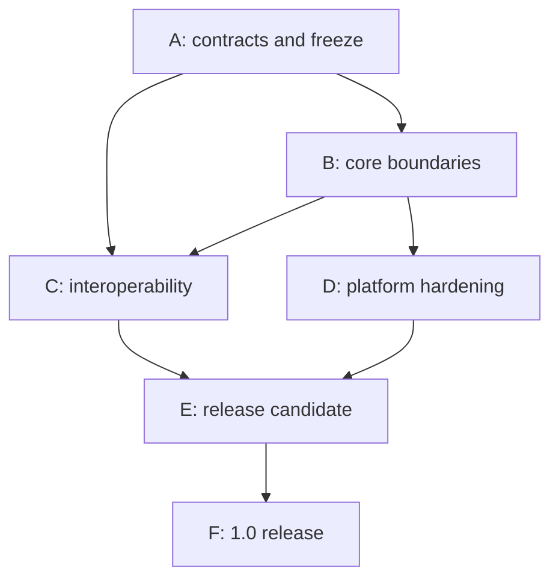

# OMI Studio 1.0 Refactoring and PR Plan

**Baseline:** Studio `eca2cf45762116e1c00a89b3397840ed89109511` and the audited 2026-09-19 OMI/PKP commits  
**Goal:** reach `1.0.0-rc.1` and then `1.0.0` through small, independently testable, reversible pull requests.

> The identifiers A01–F03 define **53 planned PR units**. They are planning identifiers, not existing GitHub pull-request numbers.

## 1. Execution principles

1. Contract or adapter first, call-site migration second, legacy removal last.
2. Each PR has one primary architectural change. Mechanical moves and semantic changes should not be mixed.
3. High-risk refactoring begins with characterization or golden fixtures.
4. During format migration, use dual-read/new-write or shadow validation; never silently convert in place.
5. Legacy route/store facades remain until all known consumers have moved.
6. A rollout flag is not a compatibility strategy. Format, identity, and security changes require explicit forward and rollback behaviour.
7. Test data is synthetic, public, or explicitly created for testing. Private manuscript titles, author data, filenames, content, and local paths do not enter Git or CI logs.

## 2. Dependency overview

Within a phase, PR identifiers are arranged in dependency order. The register later in this document identifies work that can proceed in parallel.

## 3. Phase A — Architecture freeze

**Exit condition:** accepted compatibility policy; candidate normative schema/container/content contracts; agreed direction for `/api/v1` and connector contracts; dependency-boundary lint; stable/preview/deferred support matrix.

| PR | Goal | Prerequisite | Required evidence | Risk |
|---|---|---|---|---|
| A01 | Freeze stable/preview/deferred 1.0 scope and the independent version axes. | — | documentation links and support-matrix completeness | low |
| A02 | Make OMI 0.2 schema/fixture conformance mandatory OMI CI and a release artifact. | A01 | current fixtures plus negative/future fixtures and schema checksum | medium |
| A03 | Vendor the released schema into Studio and introduce `OmiEnvelopeClassifier`/validator in shadow mode. | A02 | checksum-drift, valid/invalid/future classification | medium |
| A04 | Introduce explicit open policy and future-schema quarantine/read-only handling. | A03 | major/minor/invalid/oversize fixtures; no overwrite; raw recovery | high |
| A05 | Add pre-save/export validation and unknown-extension preservation. | A03, A04 | open→save semantic equality; invalid save blocked; unknown payload preserved | high |
| A06 | Freeze the required OMI-SPEC-100 portable-content AST candidate and add `ContentCodec`. | A01 | legacy text/current PM JSON → AST → PM golden fixtures; unknown-node diagnostics | high |
| A07 | Freeze an OMI-SPEC-330 container manifest/path/checksum/security candidate derived from the working parser. | A02, A03 | cross-repo golden containers and hostile/corrupt package fixtures | high |
| A08 | Define common diagnostics, fidelity, validation, and provenance base contracts. | A01 | serialization, stable codes, redaction | low |
| A09 | Create additive `/api/v1` transport foundations with error/idempotency/correlation contracts. | A01 | contract tests and middleware ordering | medium |
| A10 | Enforce dependency direction and compatibility re-export patterns. | A03, A06, A09 | forbidden core→UI/editor/Prisma/network import fixtures | low |

**Phase blockers:** no owner for the OMI schema release process; insufficiently concrete OMI-SPEC-100 content grammar; unresolved SPEC-330/implementation differences; undefined stable platform/export scope.

## 4. Phase B — Core refactoring

**Exit condition:** create/open/save and primary editing/history flows are behind the application facade; Tiptap boundary is explicit; portable/persistence/UI ownership is separated; native credentials are not stored in localStorage.

| PR | Goal | Prerequisite | Required evidence | Risk |
|---|---|---|---|---|
| B01 | Introduce application ports and a `StudioApplication` facade without changing current model behaviour. | A10 | fake repository/clock/ID-generator tests | medium |
| B02 | Move document create/open/save/close/recover behind the facade. | A04, A05, B01 | create/open/save/reopen; invalid/future; dirty-close matrix | high |
| B03 | Split Zustand ownership into document projection, UI state, editor session, and persistence projection. | B01, B02 | current suite plus selector/action characterization | high |
| B04 | Consolidate automatic checkpoint timers into one document-scoped scheduler. | B03 | fake-clock close/switch/reopen; no duplicate commit | medium |
| B05 | Route every Tiptap-content reader/writer through `ContentCodec`. | A06, B01 | existing editor/export golden diffs and corrupt-node diagnostics | high |
| B06 | Make new saves use the portable OMI AST; treat the pre-stable Tiptap-string form only as explicit import. | A05, B05 | AST round-trip; experimental legacy import; future-major quarantine | high |
| B07 | Add `RevisionRepository` using the current full-snapshot algorithm as the first adapter. | B01, B06 | history/revert/integrity across adapters | medium |
| B08 | Add crash-safe atomic save/recovery journal and opaque `DocumentLocation`. | B02, B07 | fault injection at write stages; backup restore; digest conflict | high |
| B09 | Formalize identity DB authority and the main-DB `StudioPrincipal` projection. | A09 | migration rollback, idempotent ensure, drift/reconcile, auth flows | high |
| B10 | Add platform `SecureStorage` and migrate native bearer tokens. | B01 | upgrade migration, logout/revoke, absence from localStorage | high |
| B11 | Separate account, auth identity, scholarly agent, contribution, and evidence mapping. | B09 | no implicit email/ORCID merge; verified link/revoke | high |
| B12 | Replace string-offset proofing/tracked changes with stable-anchor/semantic-operation representation behind an adapter. | B05, B06 | concurrent edits, Unicode/graphemes, accept/reject round trip | high |
| B13 | Remove or isolate orphaned alpha workspace state and empty domain placeholders. | A10, B03, usage audit | build/tests and no active references | low |

B03, B05, B06, B08, and B09 deliberately remain separate rollback domains. Store ownership, file-format writing, persistence safety, and identity authority must not be changed in one PR.

## 5. Phase C — Interoperability hardening

**Exit condition:** common importer, renderer, connector, and review contracts; OJS and OMP satisfy one connector suite; publication artifacts are reproducible and validated; schema/container conformance is mandatory.

| PR | Goal | Prerequisite | Required evidence | Risk |
|---|---|---|---|---|
| C01 | Introduce an `Importer` registry with source/probe/progress/abort/diagnostics/fidelity contracts. | A08, B01, B06 | fake importer, ambiguity/probe, abort, redaction, no mutation before commit | medium |
| C02 | Wrap OMI/DOCX/PDF/HTML/table/image/music/reference importers and fix MIDI routing. | C01 | per-format golden fixtures, `.mid/.midi`, quotas/cancel/hostile corpus | high |
| C03 | Introduce `Renderer` registry and separate `ArtifactDeliveryPort`. | A08, B05, B06 | every exporter through wrapper; delivery fake; no picker in renderer | high |
| C04 | Remove publication-profile module augmentation from the manuscript model and build immutable `RenderingContext`. | C03 | embedded-profile dual read, profile version, context golden | high |
| C05 | Pin renderer/validator/font/resource versions and distinguish semantic from byte reproducibility. | C04 | repeated-build hashes, font substitution, locale/timezone, signature cross-runtime | high |
| C06 | Create common Publishing System Connector schemas for capability/launch/submission/review/writeback receipts. | A08, A09 | shared JSON contract fixtures across Studio/OJS/OMP | high |
| C07 | Adapt the OJS client and plugin to the common connector API while retaining compatibility routes. | C06 | supported OJS Docker E2E; replay/scope/files/forms/recommendations/artifacts | high |
| C08 | Adapt the OMP client and plugin to the common API with monograph/chapter extensions. | C06 | OMP Docker E2E; assigned-chapter confinement; rounds/stage files | high |
| C09 | Introduce durable outbox/idempotent saga for submission, revision, review, and artifact writeback. | C07, C08, B09 | timeout/duplicate/retry/crash, receipt reconciliation, no false rollback | high |
| C10 | Extract publishing-system-neutral review domain and harden anonymous projection. | B11, C06 | role transition matrix, identity-leak corpus, EXIF/SVG, cache/log redaction | high |
| C11 | Introduce server-issued `ExecutionGrant` for integrations, AI, translation, and reference managers. | B09, B11, A09 | denied scope, selection-only payload, confidential review, expiry/replay, audit digests | high |
| C12 | Consolidate credential storage and wrap Zotero/Mendeley/ORCID/OIDC/provider secrets consistently. | B09, C11 | dual-read migration, encryption/key rotation, revoke, no secret logs | high |
| C13 | Adapt cloud storage to one remote object-store contract with ETag/conflict receipts. | B08, C11 | SSRF redirects, ETag conflict, checksums, refresh, large/resumable behaviour | medium |
| C14 | Promote only proven export formats to stable; expose other formats as preview capabilities. | C03–C05 | JATS/HTML/DOCX/PDF gates; preview-format smoke; runtime capability UI | low |
| C15 | Harden native editorial acceptance and reviewed/unreviewed web artifacts without giving websites workflow authority; add DNS-verified publication-venue authority with separate domain-admin and editor roles. Files: web artifact service/UI, editorial decision and venue-authority services, identity/application Prisma migrations, `/api/v1/publications/web`, venue authority API, WordPress/generic adapter, docs. | C03–C05, C09–C11 | exact-revision/content evidence, DNS challenge/revalidation, domain-admin delegation/last-admin protection, editor grant/revoke/concurrency, hidden/false/missing seal, privacy, scoped grants, idempotency, target-version changes, dual transport digests, both PostgreSQL migrations, receiver E2E, timeout/crash/retry/reconcile, accessibility | high |

C15 is a Preview API/DB extension (ADR-021), not a stable-delivery promotion. Scope delivery to existing renderers/adapters. Keep source-state updates synchronous and bind evidence before computing the approved artifact hash. Split contract/characterization, native acceptance, outbox/delivery and receiver/recovery gates into separately reviewable commits or follow-up PRs. A feature flag may disable new delivery while preserving workflow records; do not drop decision/outbox tables during rollback. False assurance, reviewer leaks and data loss remain blockers even for Preview.

**Phase blockers:** unavailable test images for supported PKP versions; font licensing that prevents reproducible resource bundling; no selected JATS/profile requirement; no clear owner of the common connector DTO.

## 6. Phase D — Platform hardening

**Exit condition:** every stable platform uses the same core/application suites; platform-port contracts pass; performance and accessibility budgets are agreed.

| PR | Goal | Prerequisite | Required evidence | Risk |
|---|---|---|---|---|
| D01 | Introduce complete platform port set: picker/filesystem/secure storage/auth handoff/updater/fonts/share/notifications. | B08, B10, C03 | contract fakes, web/Tauri adapter tests, forbidden direct-import lint | high |
| D02 | Harden web file/session/recovery and PWA/browser fallbacks. | D01 | Chrome/Firefox/WebKit open/edit/save/reopen, quota, denied permission, offline | medium |
| D03 | Harden Windows/Linux/macOS Tauri artifacts and update flow. | D01 | install, open-with, atomic save, update/rollback, signed artifact | high |
| D04 | Harden Android SAF/auth/update/process-death behaviour. | D01 | Android 10+ persisted permissions, large files, process death, update | high |
| D05 | Complete iOS/iPadOS preview adapters without stable promotion. | D01 | simulator/device smoke, Files permission, background/resume, privacy | medium |
| D06 | Set performance budgets and improve main-chunk/editor/renderer lazy loading. | B03, B05, C03 | 10k/120k/500k benchmarks, heap/editor count, bundle budget | medium |
| D07 | Make critical accessibility journeys release-blocking. | B03, D02 | keyboard-only create/edit/review/export, axe, screen-reader smoke, zoom/contrast | medium |
| D08 | Publish stable/preview platform capability manifest and runtime display. | D02–D07 | artifact capability snapshot and documentation/runtime equality | low |

## 7. Phase E — Release Candidate

**Exit condition:** `1.0.0-rc.1` artifacts produced from one commit; every mandatory gate green; no P0/P1 data-loss/security/anonymity blocker; acceptance report completed.

| PR | Goal | Prerequisite | Required evidence | Risk |
|---|---|---|---|---|
| E01 | Build common hostile-input/security corpus and fuzz harness. | A04, A07, C02, C10 | ZIP bombs/traversal, XXE/entities, SVG/script, SSRF, malformed JSON, log redaction | high |
| E02 | Create exact-commit RC aggregator workflow with no path filters. | all A–D gates | full matrix and artifact/SBOM/provenance hashes | medium |
| E03 | Run synthetic/public acceptance corpus and local-only private acceptance protocol. | C14, D08, E01 | format/platform journeys; only content-free private metrics/results leave the device | medium |
| E04 | Freeze API/schema/container/connector compatibility baseline and generate release documentation. | E02, E03 | breaking-diff detector, documentation links, fixture checksums | high |
| E05 | Build and test `1.0.0-rc.1` artifacts. | E02–E04 | exact-tag mandatory gates, install/update/rollback, signatures | high |

### RC soak and exit

- Use a predetermined soak period on every stable platform.
- Any P0/P1 defect requires a new RC.
- No waiver is permitted for data loss, credential leakage, anonymity breach, schema corruption, or signature mismatch.
- P2 may remain only with an owner and documented workaround when it does not violate a stable contract.
- Private acceptance manuscripts remain local. CI/Git receives only content-free metrics and synthetic minimal reproducers.

## 8. Phase F — 1.0 release

| PR | Goal | Prerequisite | Required evidence | Risk |
|---|---|---|---|---|
| F01 | Promote the last unchanged RC commit to `1.0.0`. | signed RC exit | artifact identity or justified reproducible rebuild | low |
| F02 | Publish support/deprecation/security-response channels and compatibility fixture package. | F01 | public links/checksums/install smoke | low |
| F03 | Open the 1.0.x hardening milestone for compatible changes only. | F01 | issue-template policy | low |

`1.0.0` must not contain a functional fix that was not in the final RC. Any code change requires another RC.

## 9. Dependency register

| PR | Direct dependency | Useful parallelism |
|---|---|---|
| A01 | — | — |
| A02 | A01 | A08, A09 |
| A03 | A02 | A06, A08, A09 |
| A04 | A03 | A06, A07 |
| A05 | A03, A04 | A07–A10 |
| A06 | A01 | A02–A05, A08–A10 |
| A07 | A02, A03 | A04–A06, A08–A10 |
| A08 | A01 | A02–A07, A09–A10 |
| A09 | A01 | A02–A08 |
| A10 | A03, A06, A09 | — |
| B01 | A10 | — |
| B02 | A04, A05, B01 | B09 |
| B03 | B01, B02 | B09, B10 |
| B04 | B03 | B05, B09–B11 |
| B05 | A06, B01 | B09–B11 |
| B06 | A05, B05 | B09–B11 |
| B07 | B01, B06 | B09–B11 |
| B08 | B02, B07 | B09–B12 |
| B09 | A09 | B02–B08 |
| B10 | B01 | B03–B09 |
| B11 | B09 | B03–B08, B10 |
| B12 | B05, B06 | B07–B11 |
| B13 | A10, B03 | B04–B12 |
| C01 | A08, B01, B06 | C06 |
| C02 | C01 | C03, C06 |
| C03 | A08, B05, B06 | C01, C06 |
| C04 | C03 | C01–C02, C06 |
| C05 | C04 | C06–C08 |
| C06 | A08, A09 | C01–C05 |
| C07 | C06 | C08, C10 |
| C08 | C06 | C07, C10 |
| C09 | C07, C08, B09 | C10–C14 |
| C10 | B11, C06 | C07–C09 |
| C11 | B09, B11, A09 | C07–C10 |
| C12 | B09, C11 | C09–C10, C13–C14 |
| C13 | B08, C11 | C09–C12, C14 |
| C14 | C03–C05 | C09–C13 |
| C15 | C03–C05, C09–C11 | C12–C14 |
| D01 | B08, B10, C03 | — |
| D02–D05 | D01 | one another |
| D06 | B03, B05, C03 | D02–D05, D07 |
| D07 | B03, D02 | D03–D06 |
| D08 | D02–D07 | — |
| E01 | A04, A07, C02, C10 | Phase D |
| E02 | all A–D gates | E01 and E03 preparation |
| E03 | C14, D08, E01 | E02 |
| E04 | E02, E03 | — |
| E05 | E02–E04 | — |
| F01 | RC exit | — |
| F02 | F01 | F03 preparation |
| F03 | F01 | — |

## 10. Why the larger refactors are justified

| Refactor | Why a small patch is insufficient | Why a rewrite is unnecessary |
|---|---|---|
| Tiptap ↔ OMI content boundary | independent consumers parse the same serialized representation | keep editor/extensions/parsers, place them behind one codec |
| Zustand/application split | global store ownership prevents platform-independent testing and mixes timers/persistence/UI | characterize actions, then delegate incrementally; selectors remain |
| history repository | full snapshots scale poorly and history is duplicated | keep revision IDs, semantics, revert, integrity; change storage behind port later |
| identity authority | two schemas contain overlapping user/session/identity concepts | keep working identity DB and bridge; add projection/reconciliation |
| common connector API | parallel OJS/OMP DTOs multiply with every new publishing system | keep both clients/plugins as adapters |
| review projection | anonymity is a security boundary, not a UI preference | keep server allowlist/sanitizer and strengthen it with contracts/corpus |

## 11. Rollback strategy

- **Schema/open:** A03 shadow validation is independently reversible. After A04, the old parser is only an explicit legacy-import path. Newer saved formats are never silently downgraded.
- **Content AST:** B05 keeps the wire representation unchanged while consumers move behind the codec. B06 changes the writer generation. Rollback treats new files as read-only/recovery input rather than overwriting them with an older writer.
- **Store:** compatibility selectors/actions preserve UI while slices delegate to application services.
- **Database/identity:** expand → migrate → contract. Additive/nullable fields first, dual-read and reconciliation second, destructive cleanup last. Every migration requires tested restore/down procedure.
- **Connector/outbox:** adapters may be selected by controlled rollout, but queued outbox intent must never be lost. Rollback workers must understand both active payload generations during transition.
- **Platform:** adapter selection occurs at composition roots. A legacy adapter remains only while it still satisfies the current security policy.

## 12. Milestones

| Milestone | Includes | Exit artifact |
|---|---|---|
| `1.0-architecture-freeze` | A01–A10 | accepted/deferred ADRs and pinned schema/container/content/API candidates |
| `1.0-core-boundaries` | B01–B13 | application facade, portable content, persistence/history/identity boundaries |
| `1.0-interoperability` | C01–C15 | common import/render/connector/review/web-assurance contracts and evidence |
| `1.0-platform-hardening` | D01–D08 | stable platform matrix and budgets |
| `1.0-rc.1` | E01–E05 | signed exact-commit RC plus evidence manifest |
| `1.0.0` | F01–F03 | unchanged promoted RC plus public compatibility/support policy |

## 13. Minimum issue/PR template

Each architecture migration PR should state:

- contract/ADR reference;
- dependency boundary before and after;
- preserved current behaviour and intentional behaviour change;
- affected stable/preview capability;
- synthetic/public fixture reference;
- rollback trigger and data-compatibility note;
- test evidence plus performance/security impact;
- documentation/specification mismatch closed or intentionally left open.

This decomposition is intentionally conservative. The 1.0 programme should optimize for reversible convergence on explicit contracts, not for the visual neatness of one large refactor.
