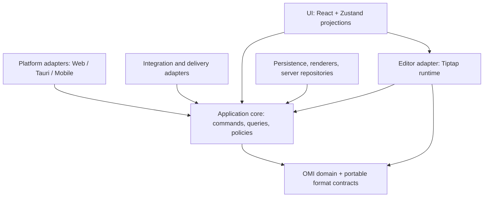
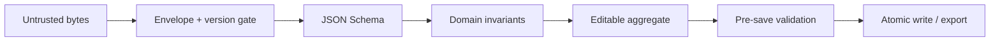
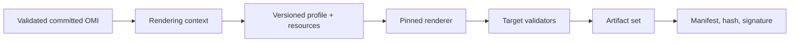
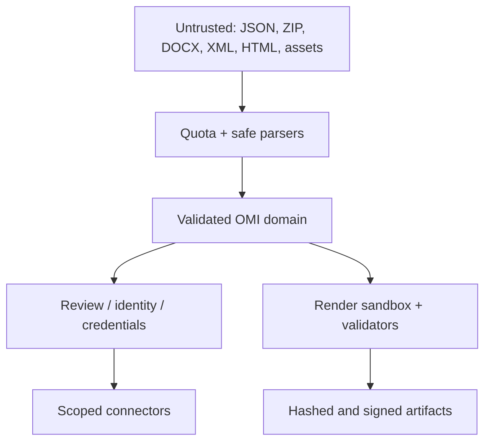

# Open Manuscript Studio 1.0 Target Architecture

**Status:** proposed 1.0 target architecture, prepared for architecture-freeze decisions  
**Audit date:** 2026-09-19  
**Primary implementation baseline:** `open-manuscript-studio/main` @ `eca2cf45762116e1c00a89b3397840ed89109511`  
**Related baselines:** `omi` @ `e2f421707f1154c0ed30cb7750e0689a837e9b0a`; `omi-ojs-plugin` @ `6c0842fc1ce6c4a1ea75f7b27660af8011be303b`; `omi-omp-plugin` @ `4f7a2c0a2f29f68e3ad05ac73ca7652bc6410ac7`

> This is an implementation-architecture document. Normative OMI specifications remain authoritative for interoperable OMI semantics. Where implementation and specification differ, this document records the gap rather than silently treating either side as equivalent.

## 1. Executive decision

Open Manuscript Studio 1.0 should be created by stabilizing the existing working product behind explicit contracts, not by designing a replacement application.

The following implementation assets should remain central to 1.0:

- the Tiptap-based editor and semantic extensions;
- study-level continuous editing and progressive mounting;
- the current immutable revision/revert semantics;
- the secure OMI container reader;
- publication build, artifact hashing, and provenance;
- DOCX, JATS, HTML, PDF, and related format processing;
- cloud-storage adapters and existing SSRF controls;
- the Tauri shell and mobile platform work;
- server-side PKP authorization and signed launch handling in the OJS/OMP integrations.

The deepest changes are required at boundaries where the current implementation has accumulated multiple responsibilities:

1. OMI-SPEC-320 must become a runtime-enforced interoperable format contract.
2. Tiptap/ProseMirror representation must move behind an editor adapter instead of behaving as portable manuscript data.
3. application use cases must move out of React/Zustand state management;
4. identity, review, integration, and external-writeback authority must be explicit;
5. 1.0 release evidence must be generated on one exact RC commit without path-filter omissions.

## 2. Evidence model

The audit applies three evidence classes:

- **implementation** is the primary evidence of current operational behaviour;
- **tests and CI** are evidence that a behaviour is currently verified;
- **OMI specifications** define the intended interoperable contract and the target for conformance.

A working implementation is not automatically wrong when it differs from an unfinished specification. Conversely, existing behaviour is not automatically a stable contract. Differences must be made explicit and then resolved deliberately.

Key audited areas include:

- `src/types/omi.ts`, `src/document/createBlankManuscript.ts`, and `src/services/exportOmi.ts`;
- `src/components/BlockEditor.tsx`, `src/editor/continuousManuscriptDocument.ts`, `progressiveStudyMounting.ts`, and focus lifecycle code;
- `src/app/useStudioStore.ts`, action modules, and session persistence;
- versioning, working-state, and integrity models;
- OMI container and ZIP handling;
- publication profiles, renderers, manifests, and artifacts;
- backend routes, services, both Prisma schemas, and integration services;
- OJS/OMP Studio adapters and both PKP plugins;
- OMI-SPEC-320 schema, fixtures, and file-format tests;
- Studio and OMI CI/release workflows.

## 3. Target dependency architecture



Arrows describe dependency direction. Core layers define ports; adapters implement them.

The domain layer must not import React, Tiptap, Zustand, Tauri APIs, Prisma clients, OJS/OMP transport DTOs, or network clients.

### 3.1 Target module boundaries

The project does not need to become a multi-package monorepo merely for architectural cleanliness. The required boundaries can first be enforced inside the existing repository:

```text
src/
  core/
    omi/
      format/
      manuscript/
      identity/
      annotations/
      references/
      assets/
      history/
      proofing/
    review/
  application/
    documents/
    editing/
    history/
    import/
    export/
    publishing/
    review/
    references/
    identity/
    ports/
  editor-tiptap/
    codec/
    runtime/
    extensions/
    mounting/
  adapters/
    persistence/
    platform/
    renderers/
    importers/
    connectors/
    api/
  ui/
    state/
    components/
server/
  api/v1/
  application/
  domain/
  adapters/
```

These paths describe a target shape, not a request for one mechanical move PR. Existing imports should survive temporarily through compatibility re-exports while call sites move.

### 3.2 Dependency rules

| Layer | May depend on | Must not depend on |
|---|---|---|
| `core/omi` | standard TypeScript utilities, pure validation primitives | React, Tiptap, Zustand, Tauri, fetch, Prisma, OJS/OMP |
| `core/review` | minimal public OMI core types | connector DTOs, UI, Prisma |
| `application` | core and application-owned ports | React components, concrete platform/storage/provider implementations |
| `editor-tiptap` | core plus application command/query API | Zustand internals, persistence adapters |
| `adapters` | application ports plus wire contracts | unrelated concrete adapters except at composition roots |
| `ui` | application facade, editor facade, UI/session state | Prisma, parsers, renderer internals |
| `server/api` | server application facade plus transport schemas | direct Prisma business mutations |

These rules should be executable through lint/import-boundary tests rather than remaining prose only.

## 4. OMI Core

### 4.1 Ownership

OMI Core owns portable manuscript meaning and interoperable representation:

- envelope and document kind;
- volume, study, section, block structure, stable identifiers, and ordering;
- scholarly agents and contributions;
- descriptive and local scholarly metadata;
- annotations, notes, citations, bibliography, anchors, and cross-references;
- asset identity, checksum, media type, and semantic role;
- revision/history semantics and publication corrections;
- portable proofing/tracked-change semantics;
- namespaced extension data and declared profiles/capabilities.

It does not own editor instances, selection, focus, viewport, undo stacks, local paths, browser file handles, cloud object identifiers, login sessions, OAuth tokens, OJS/OMP workflow state, publication CSS, installed font locations, or Prisma rows.

### 4.2 Current-to-target placement

| Current area | 1.0 ownership | Direction |
|---|---|---|
| `src/types/omi.ts` | multiple `core/omi` modules | SPLIT |
| identity/contributor models | `core/omi/identity` | KEEP/HARDEN |
| citation/reference models | core references plus renderer adapter for rendering | SPLIT |
| notes/anchors/xrefs | `core/omi/annotations` | HARDEN |
| assets + asset repository | asset domain plus persistence adapter | SPLIT |
| versioning/working state | history semantics plus application history | KEEP/HARDEN |
| proofing | `core/omi/proofing` | REFACTOR anchors/payloads |
| publication profile/style model | application publishing / renderer contract | MOVE from manuscript domain |
| empty placeholder domain modules | no independent entry point | REMOVE after re-export migration |

## 5. File-format contract and version policy

Studio 1.0 must distinguish separate version axes:

| Version axis | Carrier | Meaning |
|---|---|---|
| OMI file-format version | `omi.version` | envelope and required wire vocabulary |
| exact schema identity | top-level `schema` URI | exact JSON Schema document |
| container version | container manifest | package, paths, checksums, entry rules |
| generator/application version | provenance | software that produced the artifact |
| manuscript revision | history/revision ID | intellectual/content state, not wire-format version |

No additional `schemaVersion` field should be introduced. The `schema` URI and `omi.version` already express schema identity and format generation. Adding a third equivalent field would create another drift source.

### 5.1 Source of truth

The released JSON Schema in the `omi` repository is the normative machine-executable wire contract. Studio should:

1. vendor an immutable released schema pinned by checksum;
2. generate or derive wire types/codecs from it;
3. keep richer domain types separately;
4. check URI, version, and checksum consistency in CI;
5. execute the same conformance fixtures as the OMI repository.

Schema validation is necessary but not sufficient. The complete gate is:

`schema validation + semantic/domain invariants + referential integrity`.

### 5.2 Validation lifecycle



Validation occurs:

- before open/import: quotas, safe parsing, envelope/version classification;
- before editable state: exact schema, invariants, references, asset manifest;
- after commands: cheap local invariants where useful;
- before checkpoint/save/export/submission: complete validation;
- during container restore: package integrity first, manuscript validation second;
- at server boundaries: transport validation and authorization before domain mapping.

Invalid state must never silently overwrite the source file.

### 5.3 Compatibility policy

| Input | Open | Edit | Overwrite | Policy |
|---|---:|---:|---:|---|
| supported frozen stable generation | yes | yes | after validation | normal |
| later minor in same major with explicit forward policy | yes | policy-dependent | only after proven preservation | capability/extension check |
| later minor without policy | quarantine/read-only | no | no | raw export or controlled Save As |
| later major | quarantine/read-only | no | no | no silent downgrade |
| earlier stable version with explicit migration | yes | after migration | as target version | audited `from -> to` migration |
| pre-stable experimental Studio format | best-effort import or reject | only after successful import | write a new stable artifact | no permanent legacy guarantee |
| invalid/unknown envelope | no | no | no | diagnostics and raw recovery |

Compatibility obligations begin with the first frozen stable format. Pre-stable experimental formats do not require an indefinite migration framework.

### 5.4 Unknown extensions

A standard namespaced `extensions` map should preserve vendor extension payloads even when Studio cannot interpret them.

Known extension codecs may validate and interpret their payloads, but the raw semantic payload must remain preservable. A failed extension decode must not imply silent deletion.

Forward-minor files are editable only if policy and tests prove unknown data can survive the round trip. Export diagnostics distinguish at least: unchanged, normalized, downgraded, externalized, and dropped.

## 6. Editor Engine

### 6.1 Tiptap remains the editor runtime

Tiptap is retained for 1.0. The audited implementation already demonstrates rich editing, semantic marks, citation/note/xref nodes, continuous editing, and study lifecycle.

Tiptap is an adapter, not the portable manuscript wire model:

```text
Portable OMI content tree
        ⇅ versioned ContentCodec
ProseMirror document / Tiptap extensions
        ⇅ EditorSession
React view + runtime-only state
```

The first codec implementation may still read the existing serialized Tiptap JSON representation. That allows incremental migration. Every consumer should move behind the codec before the stable portable representation is changed.

### 6.2 Portable versus runtime-only

| Portable | Runtime-only |
|---|---|
| stable document/study/section/block IDs | Tiptap `Editor` instance |
| semantic block type and content tree | ProseMirror transaction/plugin state |
| semantic inline marks | selection/head/anchor positions |
| citation/note/xref/asset IDs | focus registry and toolbar state |
| list/table/equation structure | viewport and mounted-editor set |
| portable tracked changes and attribution references | local undo/redo stack |
| stable domain annotation anchors | decorations/search highlights |

### 6.3 Large-document lifecycle

Study-level ProseMirror documents and progressive mounting should remain.

Hardening requirements include:

- bounded active editor count and memory budgets at 500k synthetic words;
- selection preservation through mount/unmount and tab restore;
- atomic cross-study cut/paste commands;
- virtualized outline and search results;
- cache invalidation keyed by document revision and codec version;
- worker/background execution for expensive import/render work with cancellation and progress.

### 6.4 Undo versus revision history

Editor undo/redo is session-local runtime behaviour.

Working changes are application-level semantic mutations.

A revision is a durable, identified, validated commit with actor/time/message/provenance.

A publication correction is an auditable event linked to published evidence.

Undo state is not serialized as portable history. Reverting a durable revision creates a new revision rather than deleting history.

## 7. Application Core

The application layer owns user-facing use cases independently of React:

| Context | Representative use cases |
|---|---|
| Documents | create, open, validate, save, Save As, close, recover, import study |
| Editing | add/move/delete study, volume, section, block; semantic edits |
| History | checkpoint, commit revision, revert, integrity verify |
| Import | probe, import, inspect diagnostics/fidelity, commit draft |
| Export | select renderer, construct context, render, validate, deliver |
| Publishing | resolve profile, reproducible build, sign/hash, submit |
| Review | create anonymous projection, workspace, form/attachment, recommendation, writeback |
| References | lookup, import, synchronize providers, reconcile |
| Identity | link verified account evidence to scholarly agents |
| Integration | authorize scoped execution, minimize payload, execute, audit, apply suggestion |

A lightweight command/query facade is sufficient. A large CQRS framework is not required.

Commands carry expected revision/preconditions where concurrency matters and return structured diagnostics. Domain events can drive checkpoint scheduling, UI projections, and outbox work without making UI state authoritative.

## 8. State ownership

Zustand remains useful for view and session projections but should cease to be the universal application/domain service.

| State | Authority | Examples |
|---|---|---|
| portable manuscript | document/application aggregate | structure, metadata, scholarly objects |
| editor runtime | editor session | selection, mounted editors, local undo |
| UI state | Zustand | panel visibility, active tab, zoom |
| account/session | auth session service | actor and role projection, not raw secret |
| persistence session | `DocumentSession` | location, dirty state, last saved digest, recovery |
| cache | cache services | parsed documents, search index, thumbnails |

The existing automatic checkpoint timer should be consolidated into one scheduler service rather than allowing component/action-level timer chains.

The legacy alpha workspace model should not be merged into 1.0 core without usage evidence. It should either be removed after verification or isolated as post-1.0 experimentation.

## 9. Persistence and authority

### 9.1 Authority matrix

| Data | Authority | Projection/cache |
|---|---|---|
| portable manuscript current state | open working OMI document and saved OMI artifact | IndexedDB recovery, UI projection |
| revision history | document-scoped `RevisionRepository` | memory index/container optional entries |
| native working location | platform-owned `DocumentLocation` | session metadata |
| container manifest/assets | container artifact | extraction cache |
| server workflow manuscript snapshot | explicit server workflow snapshot | client session |
| account/auth | identity database | `StudioPrincipal` projection and client session |
| scholarly agent/contribution | portable manuscript | verified account-agent evidence |
| institution/membership/admin | identity database | authorization claims |
| integration credentials | encrypted credential repository | short-lived token cache |
| review workflow | Studio review DB or external PKP system according to origin | assignment-scoped workspace |
| OJS/OMP publication workflow | OJS/OMP | connector receipt/status |
| publication profile | versioned profile/build input | UI draft |

A cloud provider is a byte store, not a manuscript semantic authority.

### 9.2 Persistence ports

The application layer should depend on ports such as:

- `ManuscriptRepository`;
- `RevisionRepository`;
- `AssetRepository`;
- `RecoveryRepository`;
- `DocumentLocation` and platform file operations.

Save should be atomic where the platform permits it and should use digest/version preconditions to detect concurrent or external modification.

## 10. Import and export

### 10.1 Importer contract

All importers should expose common behaviour:

- `probe` is side-effect free;
- descriptors declare MIME types, extensions/signatures, random-access/streaming needs, platform requirements, limits, and output profile;
- import returns a draft plus imported assets, diagnostics, fidelity report, and provenance;
- imported content becomes current document state only after an explicit application-level commit.

### 10.2 Renderer/export contract

A renderer receives a versioned render request/context and returns:

- byte artifacts;
- diagnostics;
- fidelity/loss report;
- validation results;
- render provenance.

The renderer does not open a save picker and does not directly call download APIs. Artifact delivery is a separate port implemented by browser download, native Save As, Android SAF, Apple Files, cloud stores, or connectors.

### 10.3 Diagnostics and fidelity

Diagnostics require stable codes, severity, phase, source object/location, recoverability, localized message key, and structured details.

Manuscript text and local paths are not logged by default.

Fidelity outcomes should at least distinguish preserved, normalized, approximated, externalized, dropped, and blocked.

### 10.4 1.0 format classification

| Format | 1.0 architecture status |
|---|---|
| OMI JSON/container | stable contract after schema/container freeze and conformance |
| DOCX import/export | strong stable candidate; requires fidelity contract |
| PDF import | best-effort with explicit loss report |
| HTML import/clipboard | stabilizable sanitized subset |
| spreadsheet/table/image import | stabilizable importers with asset limits |
| MusicXML | preview-to-stable according to semantic fixture evidence |
| MIDI | implementation exists but routing defect must be fixed before support claim |
| RIS/BibTeX/CSL-JSON | stabilizable reference interchange |
| JATS and semantic HTML export | strongest stable export candidates |
| print PDF | stable candidate with pinned renderer/font and visual regression evidence |
| interactive PDF | separate capability/profile |
| EPUB/LaTeX | preview until fidelity corpus is sufficient |
| IDML/XPress/MIF/Scribus | preview or deferred stable guarantee |

Large-file interfaces should support streams or spooling where practical. Random-access requirements and limits must be declared. Long operations need cancellation, progress, resource budgets, and deterministic cleanup.

## 11. Publication architecture



Only a validated committed revision may produce a release artifact. A working-state render must be explicitly a draft artifact.

Validation is required both before rendering and after artifact generation.

A rendering context contains immutable manuscript projection, locale, cross-reference map, bibliography view, asset resolver, font/resource manifest, and source revision digest. It must not expose raw editor-runtime state.

Publication profiles are versioned build inputs rather than implicit manuscript mutations. Renderer and validator versions, font/resource digests, source revision, artifact hashes, and target profile become reproducibility evidence.

## 12. Publishing System Connector API

OJS and OMP should implement a shared connector vocabulary rather than separate application semantics.

The common contract covers:

- launch/handshake and signed context;
- actor and capability/scopes;
- submission/project identity;
- metadata projection;
- file list and content retrieval;
- review assignment and projection;
- writeback operations;
- idempotency and receipts;
- supported protocol/profile versions.

Journal and monograph differences remain profile-specific.

External writeback is distributed work. The Studio transaction commits local intent and a durable outbox record; external execution occurs with idempotency and produces a receipt/status. Retriable failure does not require pretending that two databases share one transaction.

## 13. Peer review

Peer review is a publishing-system-neutral application/domain context, not an OJS DTO model.

It owns concepts such as assignment, round, projection, workspace, attachment, form, recommendation, visibility, and writeback.

Double-anonymous handling is a server-side security boundary. The server constructs a projection from a committed source revision. The client never receives a complete manuscript and then hides identifying fields.

Anonymity review must cover:

- contributor metadata;
- filenames;
- asset metadata and EXIF;
- SVG/XML embedded metadata;
- provenance and identifiers;
- comments/track-change authorship where relevant;
- cache keys, logs, and error messages.

Review IDs are assignment scoped where disclosure risk exists. Confidential integration access requires a server-issued grant bound to the assignment.

## 14. Identity architecture

Six concepts remain distinct:

1. account;
2. authentication/provider identity;
3. scholarly agent;
4. institution/membership;
5. contribution;
6. publication evidence.

The identity database is authoritative for account, authentication, institutional membership, and administration. The main database may maintain a `StudioPrincipal` projection required for workflow foreign keys.

The scholarly agent and contribution remain portable manuscript concepts. Matching an email address or typed ORCID must not automatically merge an account and scholarly agent. The link is explicit and evidence-bearing.

Cross-database coordination uses idempotent ensure/reconciliation or outbox behaviour rather than a fictional cross-database transaction.

Browser sessions may continue using secure HttpOnly/SameSite cookie patterns. Native bearer tokens move from `localStorage` to a `SecureStorage` platform adapter backed by OS credential facilities.

## 15. Integration architecture

Core integration vocabulary:

- **Connector** — provider/protocol adapter;
- **Credential** — secret, rotatable, account/install/provider-scoped data;
- **Capability** — allowed operation such as `reference.read` or `review.write`;
- **ExecutionGrant** — actor + connector + document/revision + purpose + data scope + capability + confidentiality + expiry/idempotency;
- **Execution** — bounded provider call with limits, cancellation, and minimized payload;
- **AuditEvent** — actor, provider, scope, digests, outcome, and correlation data without manuscript content.

The policy is default deny. A connector receives the minimum data required for one purpose.

AI and translation output defaults to suggestion semantics. Applying a suggestion is an application command. Direct provider mutation is not required as a stable 1.0 capability.

Zotero/Mendeley operate on reference scopes; ORCID provides identity evidence; storage providers operate on encrypted or controlled byte objects.

The current extension registry is not an arbitrary executable plugin sandbox. Stable 1.0 should support reviewed built-in connectors and explicitly defer a general third-party executable runtime.

## 16. Storage and cross-platform ports

`DocumentLocation` is an opaque platform handle, not a domain string path.

Adapters include:

- browser file APIs/download fallback;
- native filesystem with atomic replacement;
- Android Storage Access Framework;
- Apple Files/security-scoped URLs/bookmarks;
- synchronized local folders;
- remote object stores such as WebDAV/Nextcloud, Dropbox, OneDrive/SharePoint, Google Drive;
- OMI container repository.

After download, content always passes through the same schema/container validation path. Cloud storage never edits manuscript semantics. Conflicts use provider version/ETag preconditions instead of last-write-wins.

Common platform ports cover open/save, secure storage, auth handoff, updater/distribution, font discovery, share/open-with, and notifications.

The existing Tauri allowlist, updater, Android installation work, and delivery code form useful adapter implementations. Module-global current native paths should move to session-owned `DocumentLocation`.

## 17. Backend/API 1.0

The stable first-party transport begins at additive `/api/v1/...`.

Migration:

1. define shared Zod/OpenAPI request/response schemas and an error envelope;
2. point `/api/v1` and legacy facades at the same application handlers;
3. mark legacy routes with deprecation policy/telemetry;
4. migrate clients;
5. remove legacy routes only under the published compatibility policy.

The PKP signed integration protocol may retain installed route shapes where necessary, but payload protocol/profile version is explicit.

The server request flow is:

```text
HTTP route
  -> transport validation
  -> authentication
  -> authorization policy
  -> application use case / transaction
  -> repository and connector ports
  -> response mapping and audit
```

Route handlers do not perform direct Prisma business mutations.

Create/submit/upload operations use idempotency keys. Updates use optimistic versions/preconditions.

Standard transport errors include validation, unauthenticated, forbidden, conflict, rate-limited, external-unavailable, and integrity-failed classes.

Secrets use versioned envelope encryption and external key authority. Refresh-token rotation/revocation and provider scopes are explicit. Audit events are append-only and content-free.

Application shutdown closes both Prisma clients and long-running workers/render processes deterministically.

## 18. Security trust boundaries



| Boundary | 1.0 control |
|---|---|
| OMI JSON | quota/depth protection, version gate, schema + invariants, quarantine |
| OMI container | keep existing traversal/size/integrity controls; add fuzz and semantic validation |
| Office/XML/HTML | shared safe ZIP/XML policy, no XXE, no unintended remote fetch, path/relationship limits |
| binary assets | magic/MIME decode, checksum, decompression limits, SVG sanitation, metadata policy |
| JATS/XML | exact schema/profile pinning, safe parser corpus/fuzz |
| HTML artifacts | forbid active script/form/event-handler/remote-content behaviour according to profile |
| OAuth/OIDC | PKCE/state/nonce, exact redirects, short state TTL, token redaction/rotation |
| connector endpoints | signed scoped grants, replay protection, redirect-aware SSRF control, timeout/idempotency |
| review data | server projection, assignment-scoped identifiers, leak tests |
| AI/translation | minimized payload, purpose/retention policy, confidential grant |
| plugins/extensions | no stable arbitrary-code claim; reviewed allowlist until sandbox exists |
| publication artifacts | exact-byte hashes, provenance, validation before transfer, key-rotation evidence |
| logs/CI | synthetic/public fixtures, redaction, no manuscript content/path leakage |

## 19. Test architecture and release gates

### 19.1 Test layers

The 1.0 test architecture includes:

- domain unit/property tests;
- OMI schema and conformance fixtures;
- explicit stable-version migration fixtures;
- importer/exporter golden fixtures;
- OMI and editor semantic round trips;
- application integration tests for save/recovery/concurrency/outbox;
- server transport/authz/database tests;
- connector contract tests shared by OJS/OMP;
- Playwright and PKP integration E2E;
- platform build/run/open/save/update smoke tests;
- security SAST/dependency/SBOM/secret scan and hostile-input corpora;
- accessibility automation plus keyboard/screen-reader smoke;
- 10k/120k/500k-word performance and resource budgets;
- crash/save corruption/recovery/outbox retry/update rollback tests.

### 19.2 Required release gates

1. **Format:** frozen schema/container, checksum pin, shared conformance fixtures, future-version and extension tests.
2. **Data integrity:** open/save/container/assets/history round trip plus atomic-save fault injection.
3. **Import:** all stable importers with fidelity and hostile-input evidence.
4. **Publication:** JATS schema/profile, HTML security/a11y, pinned PDF renderer/font and visual evidence, artifact manifest/hash/signature.
5. **Review:** role/visibility transitions and anonymity leak corpus.
6. **Connector:** common OJS/OMP contract, supported real-version E2E, replay/scope/retry/idempotency/writeback receipt.
7. **Identity/API:** `/api/v1` compatibility, database migrations, identity reconciliation, authn/authz, secure native token storage.
8. **Platform:** stable platform install/open/edit/save/reopen/update.
9. **Security:** SAST, dependencies, licenses/SBOM, secret scan, hostile parser corpus, privacy/log checks.
10. **Accessibility:** critical journeys against WCAG 2.2 AA targets with manual smoke evidence.
11. **Performance:** agreed budgets including a 500k-word synthetic document and bundle-size regression control.
12. **RC evidence:** all required gates execute on the same exact RC commit without path filters and produce an evidence manifest.

## 20. Stable 1.0 contracts

The architecture freeze should cover:

- the required portable OMI-SPEC-100 content grammar;
- OMI-SPEC-320 envelope/schema/compatibility rules;
- OMI-SPEC-330 manifest/path/checksum/security profile;
- the portable OMI-SPEC-160 history boundary;
- the required OMI-SPEC-150 agent/contribution subset;
- diagnostics, fidelity, validation, and provenance contracts for import/render;
- publication profile/build manifest/renderer descriptors;
- the common Publishing System Connector schema;
- review projection/visibility/writeback semantics;
- public `/api/v1` transport and error/idempotency policy;
- platform and persistence ports visible to core/application layers.

The full aspirational OMI-SPEC-310 API, arbitrary executable plugin runtime, CRDT/branching history, and stable fidelity for every DTP target do not need to freeze for base 1.0.

### Architecture freeze is complete when

- every ADR is Accepted or explicitly Deferred;
- schema/container/protocol candidates are available by immutable digest;
- dependency-boundary checks are active;
- new use cases access adapters only through stable ports;
- compatibility and deprecation policies are documented;
- every user-visible capability is classified stable, preview, or deferred;
- no open P0 data-loss, anonymity, credential, or integrity blocker remains.

## 21. Documentation/implementation drift recorded by the audit

| Area | Documentation/specification | Audited implementation | Required convergence |
|---|---|---|---|
| OMI format | OMI-SPEC-320 0.2.0 schema/envelope | Studio 0.1 identifiers; empty 0.2 vendored schema | released schema pin + codec + explicit pre-stable import/reject |
| container | governance/status text partly behind reality | secure ZIP manifest/checksum/history/profile/output code exists | derive normative profile and cross-repo fixtures |
| content | semantic portable model intended | serialized Tiptap JSON/legacy text in block content | freeze OMI content grammar + codec migration |
| identity | documentation partially describes future state | identity DB, OIDC/ORCID/admin operational; local password policy differs | document actual authority and freeze hash/version policy |
| API | OMI-SPEC-310 is high-level | many working but mixed unversioned routes | additive `/api/v1`, not mass rename |
| review | status material trails implementation | server projection, visibility serializer, PKP writeback exist | derive review contract/tests and harden anonymity |
| release scope | stable/preview direction exists | workflows partly path-filtered | exact-RC aggregate evidence |

## 22. Audited verification baseline

At the audit baseline:

- Studio unit/pretest suite: 441/441 passed;
- frontend lint and production build passed;
- server Prisma generation, typecheck, and build passed;
- publication release tests 16/16, direct submission 15/15, publication artifact 13/13;
- local readiness 6/6;
- OMI file-format fixtures 8/8 and OMI Docusaurus build passed;
- general Studio CI, CodeQL, desktop/Tauri, Android, and promotion workflows were green on the audited commit;
- OJS and OMP plugin CI were green on their audited commits.

Limitation: not every readiness/PKP/iOS workflow ran on the exact Studio commit because of path filters, and the OMI website build did not itself execute the file-format conformance suite. Those limitations are why exact-RC evidence is a target requirement rather than an already proven property.

## 23. Pinned sources

- [Open Manuscript Studio baseline](https://github.com/open-manuscript-initiative/open-manuscript-studio/commit/eca2cf45762116e1c00a89b3397840ed89109511)
- [OMI baseline](https://github.com/open-manuscript-initiative/omi/commit/e2f421707f1154c0ed30cb7750e0689a837e9b0a)
- [OJS plugin baseline](https://github.com/open-manuscript-initiative/omi-ojs-plugin/commit/6c0842fc1ce6c4a1ea75f7b27660af8011be303b)
- [OMP plugin baseline](https://github.com/open-manuscript-initiative/omi-omp-plugin/commit/4f7a2c0a2f29f68e3ad05ac73ca7652bc6410ac7)
- [OMI-SPEC-320 file format](https://github.com/open-manuscript-initiative/omi/blob/e2f421707f1154c0ed30cb7750e0689a837e9b0a/docs/specifications/file-format.md)
- [OMI 0.2 schema](https://github.com/open-manuscript-initiative/omi/blob/e2f421707f1154c0ed30cb7750e0689a837e9b0a/static/schemas/omi-manuscript-0.2.schema.json)

## 24. Summary

The target architecture places stable boundaries around a valuable working implementation.

The correct strategy is:

**contract first → prove current behaviour → migrate consumers → remove obsolete paths last.**

The architecture does not justify replacing Tiptap, revision semantics, the secure ZIP parser, publication build, cloud provider layer, Tauri shell, or PKP integrations. Deeper refactoring is justified only where current coupling creates concrete format, data-loss, security, portability, or release-evidence risk.

## 21. Website publication assurance supplement — 2026-09-23

This supplements the dated audit baseline; it does not promote the current implementation to stable or redefine portable OMI semantics.

### Independent review authority

Journals and presses without OJS/OMP may use Studio-native review assignments and rounds. A completed scientific round is not an acceptance decision: a separate server-authorized editor must accept the exact committed manuscript revision and state digest. Externally bound assignments are excluded from native decisions; OJS/OMP remain authoritative for their workflows.

Publication intent (`public-interest`, `popular-science`, `newsletter`, `scholarly-article`, `book-chapter`) is independent of review assurance. Unreviewed publishing is valid, including scholarly work, but must carry explicit visible and machine-readable disclosure.

### Rendering and delivery boundary

The existing HTML renderer produces an immutable committed artifact. `PublicationAssurance` is inserted before the final build hash, with either `peer-reviewed` and editorial evidence or `not-peer-reviewed`. The circular mark is language-independent: `OMI · PEER REVIEW · VERIFIED` or `OMI · PEER REVIEW · NOT VERIFIED`; the adjacent explanation is localized. The mark attests recorded workflow evidence, not scientific truth or an OMI endorsement. Public metadata contains decision ID, evidence digest, review round and decision time, never reviewer identity, confidential comments or recommendations.

Website/WordPress connectors implement only `ArtifactDeliveryPort`; they never own review authority or portable manuscript semantics. A server-issued execution grant binds artifact/build/assurance and the target configuration version. The durable outbox owns delivery state, idempotency and external receipts. Generic endpoints receive exact standalone HTML; WordPress receives a declared article/media projection whose exact outgoing digest is receipted separately from the approved standalone digest.

### Verified publication-venue authority

For non-PKP journals and presses, publication-venue authority is a separate
identity boundary. A one-time DNS TXT challenge proves control of the venue
domain and grants only `DOMAIN_ADMIN`. The domain administrator may authorize
existing Studio accounts as `EDITOR` or `EDITOR_IN_CHIEF`; domain control
alone cannot create review assurance.

A publisher-verified editorial acceptance requires both the venue editor role
and manuscript-workspace `EDITOR` access, plus the completed Studio-native
scientific review round. It is bound to revision ID, manuscript-state digest
and the assurance-neutral publication-content digest. The stored decision
includes an immutable authority snapshot (venue, domain, DNS verification
identity/time and editor role). DNS is revalidated before new decisions when
the prior check is stale; revocation affects future authority, not historical
decision provenance.

### Application/API ownership

- `PrepareWebPublication`: checkpoint, supported-asset checks, evidence retrieval and immutable artifact preparation. Move orchestration from React/Zustand behind an application facade; retain the renderer.
- `RecordEditorialDecision`: permission and native-round validation plus immutable acceptance for an exact revision/digest.
- `ApproveWebPublication` / `ExecuteWebPublication`: scoped grant, configuration/evidence revalidation, outbox and receipt.
- Additive routes: `/api/v1/reviews/workspaces/:workspaceId/editorial-decisions` and `/api/v1/publications/web/...`. The unsafe pre-v1 client-boolean publication route returns 410.
- Server workflow repositories own assignments/decisions; delivery repositories own grants/outbox/receipts; neither belongs in the portable manuscript.

### Freeze and release conditions

Freeze the assurance/authority distinction before schema/API freeze (ADR-021). Delivery remains **Preview** pending PostgreSQL migration tests, real receiver E2E, crash/timeout/retry recovery, privacy, tamper and accessibility evidence. False reviewed seals, missing unreviewed disclosure, reviewer leaks, undeclared/unreceipted transformation and data loss block release even for Preview. Do not advertise a public independent verification service or a cryptographically unforgeable visual badge.
