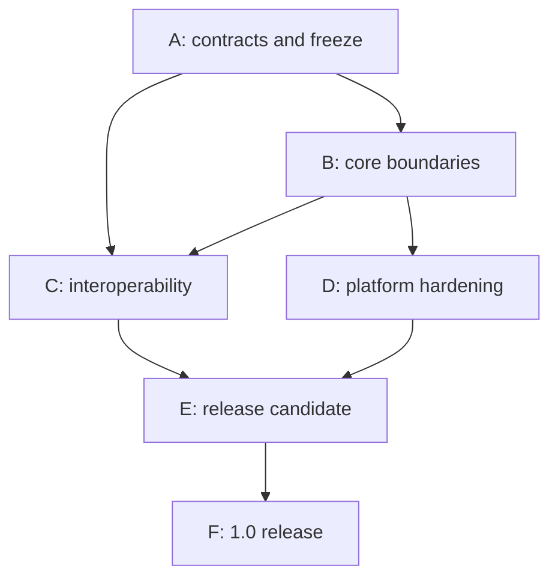

# OMI Studio 1.0 Refactoring and PR Plan

**Baseline:** Studio `eca2cf45762116e1c00a89b3397840ed89109511` és a 2026-09-19-i OMI/PKP commitok  
**Cél:** kis, külön tesztelhető, visszagörgethető PR-okkal eljutni `1.0.0-rc.1`, majd `1.0.0` kiadásig.

## 1. Végrehajtási elvek

1. Contract vagy adapter előbb, callsite-migráció utána, régi út eltávolítása legutoljára.
2. Minden PR egyetlen elsődleges architekturális változást végezzen; mechanikus move ne keveredjen szemantikai változással.
3. Magas kockázatú PR előtt characterization/golden fixture kerüljön be.
4. A meglévő fájlformátumot az átmenet alatt dual-read/new-write vagy shadow-validation védi; nincs csendes in-place conversion.
5. A régi route/store facade addig marad, amíg minden ismert kliens/callsite át nem állt.
6. A rollout feature flagje nem kompatibilitási stratégia: az adatformatum és identity/security váltásoknak explicit rollback/forward tervük van.
7. Tesztanyag kizárólag synthetic, nyilvános vagy kifejezetten tesztcélú; privát manuscript cím, szerző, fájlnév, tartalom és lokális path nem kerül Gitbe vagy CI-logba.

## 2. Függőségi kép

A fázison belül az alábbi PR-számok topologikus sorrendet jelentenek. Párhuzamosítható PR-t külön jelölünk.

## 3. Phase A — Architecture freeze

**Kilépési feltétel:** elfogadott compatibility policy; normatív schema/container/content contract candidate; `/api/v1` és connector contract irány; dependency boundary lint; feature support matrix.

| PR | Cél | Érintett modulok / várható fájlok | Előfeltétel | Kötelező teszt | Breaking-change kockázat | Technikai kockázat |
|---|---|---|---|---|---|---|
| A01 | Rögzítse az 1.0 stable/preview/deferred scope-ot és a három verzióvonalat. | OMI/Studio `docs/architecture`, `docs/release/1.0-scope.md`, ADR-k | nincs | docs link/check; support matrix completeness | nincs runtime break | low |
| A02 | Tegye az OMI 0.2 schema-fixture suite-ot kötelező OMI CI-vé és release artifacttá. | OMI `package.json`, `.github/workflows/website-build.yml` vagy új conformance workflow, `tests/file-format`, schema | A01 | 8 meglévő + új negative/future fixture; schema checksum | schema artifact freeze után breaking | medium |
| A03 | Vendorolja a released sémát a Studioba és vezessen be `OmiEnvelopeClassifier`/validator modult shadow módban. | `src/schemas/*`, új `src/core/omi/format/*`, build sync script, tests | A02 | checksum drift, valid/invalid/future classification; jelenlegi docs shadow report | nincs: még nem blokkol | medium |
| A04 | Vezessen be explicit open policyt és future-schema quarantine/read-only eredményt. | `nativeManuscriptFile.ts`, `omiContainerImport.ts`, új `application/documents/open*`, UI error/read-only state | A03 | new-major/minor/invalid/oversize fixtures; nincs overwrite; raw recovery | user-visible új elutasítás, szándékos | high |
| A05 | Vezessen be pre-save/export validation gate-et és unknown-extension preservation fixture-t. | `exportOmi.ts`, save actions, format serializer, extension bag | A03, A04 | open→save semantic equality; invalid save blocked; unknown payload hash | hibás dokumentum többé nem menthető csendben | high |
| A06 | Fagyassza a SPEC-100 portable content AST candidate-et, és adjon `ContentCodec` contractot a jelenlegi Tiptap JSON fölé. | OMI content spec/schema; Studio új `core/omi/content`, `editor-tiptap/codec`; `richText.ts`, `inlineSemantics.ts` | A01 | legacy text + jelenlegi PM JSON → AST → PM golden; unknown node diagnostics | contract még internal/candidate | high |
| A07 | Fagyassza a SPEC-330 container manifest/path/checksum/security candidate-et a működő Studio parserből. | OMI container spec/schema/fixtures; Studio `omiContainer*.ts`, `simpleZip.ts` | A02, A03 | cross-repo golden containers; corrupt/path/symlink/CRC/SHA/limits | új container writer később breaking | high |
| A08 | Definiálja az egységes diagnostics/fidelity/provenance alapcontractot. | új `src/application/diagnostics`, import/export type shimek | A01 | serialization, redaction, stable code registry | nincs | low |
| A09 | Hozza létre az `/api/v1` transport alapot közös error/idempotency/correlation contracttal, régi route érintése nélkül. | `server/src/api/v1`, Zod/OpenAPI registry, middleware, `app.ts` | A01 | contract test, error envelope, auth middleware ordering | nincs, additív | medium |
| A10 | Vezessen be import-boundary architecture testet és compatibility re-export mintát. | ESLint config/custom rule vagy dependency-cruiser, CI, új barrel modulok | A03, A06, A09 | tiltott core→React/Tiptap/Prisma/fetch import fixtures | CI új hibát jelezhet | low |

**A fázis blocker-ek:** nincs kijelölt owner az OMI schema release-re; SPEC-100 AST nem elég konkrét; SPEC-330 implementáció–spec eltérés nincs lezárva; stable platform/export scope nincs kimondva.

## 4. Phase B — Core refactoring

**Kilépési feltétel:** create/open/save és legalább a fő editing/history út application facade mögött; Tiptap adapter boundary működik; portable/persistence/UI state ownership elkülönült; native credential nem localStorage.

| PR | Cél | Érintett modulok / várható fájlok | Előfeltétel | Kötelező teszt | Breaking-change kockázat | Technikai kockázat |
|---|---|---|---|---|---|---|
| B01 | Hozzon létre application portokat és `StudioApplication` facade-ot a jelenlegi model functionök változtatása nélkül. | új `src/application/ports`, `documents`, `editing`; composition root | A10 | fake repository/clock/ID generator unit tests | nincs | medium |
| B02 | Migrálja a document create/open/save/close/recover use-case-eket a facade mögé. | `newDocumentActions.ts`, `documentLifecycle.ts`, `nativeManuscriptFile.ts`, `lastSessionPersistence.ts`, store delegate-ek | A04, A05, B01 | create/open/save/reopen; invalid/future; close dirty matrix | belső API; UI viselkedés regresszió lehetséges | high |
| B03 | Bontsa szét a Zustand ownershipot domain snapshot, UI, editor session és persistence projection szerint. | `useStudioStore.ts`, új `ui/state/*`, selector compatibility layer | B01, B02 | 441 jelenlegi teszt + selector/action characterization + fake-clock | belső action signatures átmenetileg dual | high |
| B04 | Egyesítse az automatikus checkpoint timereket egy document-scoped schedulerbe. | `useStudioStore.ts`, history/actions, új scheduler | B03 | fake timer, close/switch/reopen, no duplicate commit | nincs külső break | medium |
| B05 | Terelje a Tiptap-content összes olvasását/írását a `ContentCodec` facade mögé. | `BlockEditor.tsx`, continuous doc, citations, notes, xrefs, search, lists, proofing, clipboard, exporterek | A06, B01 | jelenlegi editor/export golden output diff; corrupted node diagnostics | nincs még wire-format break | high |
| B06 | Váltsa az új mentést a portable OMI AST-re; a pre-stable Tiptap-string formátum csak explicit import legyen. | OMI schema/content, codec, serializer, legacy importer, fixtures | B05, A05 | AST round-trip; old experimental fixture import; new-major quarantine | igen: ez az első stable format candidate | high |
| B07 | Vezessen be `RevisionRepository` portot a jelenlegi full-snapshot algoritmus adapterével. | `versioning.ts`, `workingState.ts`, `revisionIntegrity.ts`, IndexedDB/container adapter | B01, B06 | current history suite; materialize/revert/integrity cross-adapter | nincs szemantikai break | medium |
| B08 | Adjon crash-safe atomic save/recovery journal implementációt és opaque `DocumentLocation`-t. | native/browser persistence adapterek, `nativeManuscriptFile.ts`, session state | B02, B07 | kill/fail injection minden írási ponton; backup restore; concurrent digest conflict | path/session internal API változik | high |
| B09 | Formalizálja az identity DB authorityt és a main DB `StudioPrincipal` projectiont. | két Prisma schema/migration, `studioPrincipalBridge.ts`, auth service, reconciliation job | A09 | migration rollback snapshot; idempotent ensure; drift/reconcile; auth flows | DB migration, kompatibilis dual-read szükséges | high |
| B10 | Vezesse be a platform `SecureStorage` portot és migrálja a native bearer tokent. | frontend auth API, native auth handoff, Tauri/Android/Apple adapter/config | B01 | upgrade token migration, logout/revoke, XSS/localStorage absence test | régi natív session kijelentkeztethető fallbackkel | high |
| B11 | Válassza szét account, auth identity, scholarly agent, contribution és evidence mappinget. | `model/identity.ts`, linked identity routes/service, OMI agents UI/API, author signature | B09 | no implicit email/ORCID merge; verified link/revoke; contribution persistence | DTO változás v1 candidate-ben | high |
| B12 | Cserélje a proofing/tracked-change string-offset modellt stable anchor/semantic operationre adapterrel. | `model/proofing.ts`, Tiptap proofing extensions, proofreading API/UI | B05, B06 | concurrent edit/anchor remap; Unicode/grapheme; accept/reject round-trip | portable proofing schema változik a freeze előtt | high |
| B13 | Izolálja vagy távolítsa el az árva workspace alpha store-t és az üres domain placeholder modulokat. | `src/store/workspaceStore.ts`, `model/workspace.ts`, üres model fájlok, exports | A10, B03, usage audit | full build/tests; no import/reference; optional data export note | csak nem támogatott alpha state | low |

**Miért nem egy PR?** B03, B05, B06, B08 és B09 külön rollback domén. Store-refaktor közben nem szabad wire-formatot váltani; schema-váltás közben nem szabad DB authorityt migrálni. A jelenlegi viselkedést B05-ig változatlan codec védi.

## 5. Phase C — Interoperability hardening

**Kilépési feltétel:** közös importer/renderer/connector/review contractok; OJS és OMP ugyanazt a contract suite-ot teljesíti; publication artifact reprodukálható és validált; schema/container conformance kötelező.

| PR | Cél | Érintett modulok / várható fájlok | Előfeltétel | Kötelező teszt | Breaking-change kockázat | Technikai kockázat |
|---|---|---|---|---|---|---|
| C01 | Vezesse be az `Importer` registryt source/probe/progress/abort/diagnostics/fidelity contracttal. | új `application/import`, adapter registry; A08 types | A08, B01, B06 | fake importer, ambiguity/probe, abort, redaction, no store mutation before commit | nincs, wrappers | medium |
| C02 | Csomagolja be az OMI/DOCX/PDF/HTML/table/image/music/reference importereket; javítsa a MIDI routingot. | `docx*`, `pdfImport*`, `officeImport.ts`, `musicImport.ts`, `referenceInterchange.ts`, app actions | C01 | formátumonként golden; MIDI `.mid/.midi`; size/cancel/hostile corpus | import diagnostics változhat, content nem | high |
| C03 | Vezesse be a `Renderer` registryt és válassza le az `ArtifactDeliveryPort`-ot. | `export*.ts`, `exportFileDelivery.ts`, UI export panelek | A08, B05, B06 | minden exporter wrapper contract; delivery fake; nincs picker rendererből | belső API | high |
| C04 | Válassza le a publication profile-t az OMI module augmentationről és építse meg az immutable `RenderingContext`-et. | `publicationProfile.ts`, paragraph styles, publication rendering/build, profile UI/storage | C03 | old embedded profile dual-read; profile version; context golden | új profile storage contract, dual-read kell | high |
| C05 | Pinelje renderer/validator/font/resource verziókat; különítse el semantic és byte reproducibilityt. | build manifest/sidecar, JATS/HTML/PDF rendererek, font service, signature modules | C04 | repeated build hashes; font substitution; timezone/locale; signature cross-runtime | artifact manifest schema változik freeze előtt | high |
| C06 | Készítsen közös Publishing System Connector schema/package-et capability/launch/submission/review/writeback receipt contracttal. | Studio shared types/server; OJS/OMP plugin contract fixtures/docs | A08, A09 | JSON contract fixture mindhárom repo-ban; version negotiation | plugin protocol candidate változás | high |
| C07 | Illessze az OJS klienst és plugint a közös connector API-ra compatibility route-tal. | Studio OJS integrations/routes; OJS plugin routes/services | C06 | supported OJS 3.5.0-4/5 Docker E2E; replay/scope/files/form/recommendation/artifact | régi plugin kompatibilitást meg kell tartani | high |
| C08 | Illessze az OMP klienst és plugint a közös API-ra monograph/chapter extensionökkel. | Studio OMP modules/routes; OMP plugin controllers/services | C06 | OMP Docker E2E; assigned chapter confinement; rounds/stage files/attachments | régi plugin kompatibilitást meg kell tartani | high |
| C09 | Vezessen be durable outbox/idempotent sagát submission/revision/review/artifact writebackra. | Prisma migration, submission/review services, connector worker/status UI | C07, C08, B09 | remote timeout/duplicate/retry/crash; receipt reconciliation; no false rollback | DB/runtime behavior, additive | high |
| C10 | Emelje ki a publishing-system-neutral review domaint és hardenelje az anonymous projectiont. | peer review/review manuscript services, `core/review`, serializers, asset transforms | B11, C06 | role-transition matrix; identity leak corpus; asset EXIF/SVG; cache/log redaction | snapshot DTO v1 candidate változik | high |
| C11 | Vezessen be server-issued `ExecutionGrant` modellt integrations/AI/DeepL/reference manager számára. | integration contracts/execution/routes, provider registry, UI dialogs, credential repo | B09, B11, A09 | denied scope, selection-only payload, confidential review, expiry/replay, audit digest | régi request flag többé nem ad jogot | high |
| C12 | Konszolidálja a credential storage-ot és csomagolja közös connectorba Zotero/Mendeley/ORCID/OIDC/provider secret útvonalakat. | identity/main Prisma, reference manager service, secretCrypto, user integrations | B09, C11 | dual-read migration; encrypt/decrypt/key rotation; revoke; no log | DB migration | high |
| C13 | Illessze a cloud storage providereket egységes remote object store contracthoz ETag/conflict receipt-tel. | `CloudStorageProvider`, OAuth/WebDAV providers, cloud routes/client, local cloud folder | B08, C11 | SSRF redirects, ETag conflict, checksum, token refresh, large/resume behavior | additív adapter; provider UX változhat | medium |
| C14 | Promotálja csak a bizonyított export formátumokat stable-re; a többit jelölje previewként runtime capabilityből. | exporter descriptors, UI, docs, release metadata | C03–C05 | JATS/HTML/DOCX/PDF gates; DTP/EPUB/LaTeX smoke; capability UI | feature label változás | low |
| C15 | Hardenelje a webes kézbesítést és a lektorált/nem lektorált minősítést úgy, hogy a webhely ne váljon workflow-authority-vé. | web artifact service/UI, editorial decision, Prisma migration, `/api/v1/publications/web`, WordPress/generic adapter, docs | C03–C05, C09–C11 | exact-revision evidence, hamis/hiányzó pecsét, anonimitás, approval grant, idempotency, timeout/retry/reconcile, accessibility, receiver contract | Preview protocol és DB bővítés | high |

**C fázis blocker-ek:** támogatott OJS/OMP verziókhoz nincs elérhető test image; fontlicenc nem engedi a reprodukálható bundle-t; JATS/profile követelmény nincs kijelölve; connector DTO owner nincs kijelölve.

## 6. Phase D — Platform hardening

**Kilépési feltétel:** minden stable platform ugyanazt a core/application suite-ot használja; platformadapter-contractok teljesülnek; teljesítmény és accessibility budget elfogadva.

| PR | Cél | Érintett modulok / várható fájlok | Előfeltétel | Kötelező teszt | Breaking-change kockázat | Technikai kockázat |
|---|---|---|---|---|---|---|
| D01 | Vezesse be a teljes platform port-készletet: picker/filesystem/secure storage/auth handoff/updater/fonts/share/notifications. | `adapters/platform`, jelenlegi services, Tauri/mobile config | B08, B10, C03 | contract fake + web/Tauri adapter tests; tiltott direct import lint | nincs külső, belső importváltás | high |
| D02 | Hardenelje a web file/session/recovery és PWA/browser capability fallbackokat. | browser adapter, IndexedDB, last-session, auth | D01 | Chrome/Firefox/WebKit open/edit/save/reopen; quota/denied permission/offline | nincs | medium |
| D03 | Hardenelje a Windows/Linux/macOS Tauri artifactot és frissítést. | Rust/Tauri capabilities, updater, installer workflows | D01 | install, open-with, atomic save, update/rollback, signed artifact; Win11/Ubuntu stable, mac scope szerint | installer/update behavior | high |
| D04 | Hardenelje Android SAF/auth/update/process-death viselkedést. | Android adapter/project, Tauri mobile bridge, release workflow | D01 | Android 10+ picker permission persistence, large file, process death, update | platform behavior | high |
| D05 | Fejezze be az iOS/iPadOS preview adaptereket, stable promotion nélkül. | Apple Files/Keychain/auth/share adapter, simulator/release workflow | D01 | simulator + device smoke; Files permission, background/resume, privacy | preview only | medium |
| D06 | Állítson be performance budgetet és javítsa a main chunk/editor/renderer lazy loadingot. | Vite config, routes/components, exporter imports, progressive mounting | B03, B05, C03 | 10k/120k/500k benchmark; heap/editor count; main chunk budget; no ineffective dynamic import | nincs, loading UX változhat | medium |
| D07 | Tegye release-blockinggá a kritikus accessibility journey-ket. | React UI/focus styles, Playwright axe, manual checklist | B03, D02 | keyboard-only create/edit/review/export; axe; screen-reader smoke; zoom/contrast | UI kisebb változás | medium |
| D08 | Formalizálja a stable/preview platform capability manifestet és runtime kijelzést. | version/release metadata, UI About/help, docs | D02–D07 | build artifact capability snapshot; docs/runtime equality | nincs | low |

## 7. Phase E — Release Candidate

**Kilépési feltétel:** ugyanazon commitból előállított `1.0.0-rc.1` artifactok; minden mandatory gate zöld; nincs P0/P1 adatvesztési/security/anonymity blocker; acceptance report aláírva.

| PR | Cél | Érintett modulok / várható fájlok | Előfeltétel | Kötelező teszt | Breaking-change kockázat | Technikai kockázat |
|---|---|---|---|---|---|---|
| E01 | Építsen közös hostile-input/security corpust és fuzz harness-t. | JSON/ZIP/XML/HTML/DOCX/assets/JATS parser tests; CI security jobs | A04, A07, C02, C10 | ZIP bomb/traversal/duplicate; XXE/entity; SVG/script; SSRF; malformed JSON; log redaction | nincs | high |
| E02 | Készítsen exact-commit RC aggregator workflow-t path filter nélkül. | `.github/workflows/1.0-rc.yml`, reusable workflows, evidence manifest | minden A–D gate | teljes matrix; artifact/SBOM/provenance hash; rerun policy | nincs | medium |
| E03 | Futtasson synthetic/public real-world acceptance corpust és zárt privát acceptance protokollt tartalomfeltöltés nélkül. | test corpus manifest, local-only acceptance script/report template | C14–C15, D08, E01 | format/platform journeys; private run csak content-free pass/fail/metrics reportot ad | nincs | medium |
| E04 | Zárja le az API/schema/container/connector compatibility baseline-t és generálja a release dokumentációt. | specs, OpenAPI/schema snapshots, changelog, support matrix, deprecation policy | E02, E03 | breaking-diff detector; docs links; fixture checksum | freeze után minden eltérés breaking | high |
| E05 | Készítse el és tesztelje `1.0.0-rc.1` artifactokat. | version files, release workflows, installers, plugin packages, website/schema artifacts | E02–E04 | mandatory gate-ek exact tag commiton; install/update/rollback; signatures | release candidate | high |

### RC soak és exit

- Minimum egy teljes, előre rögzített soak időszak minden stable platformon.
- P0/P1 bug esetén új RC; nincs „waiver” adatvesztésre, credential leakre, anonymity breachre, schema corruptionre vagy signature mismatchre.
- P2 csak dokumentált workarounddal és ownerrel maradhat, ha nem érinti a stable contractot.
- Privát acceptance kézirat helyben marad; Git/CI-be csak content-free mérőszám és issue reproducerként synthetic minimal case kerülhet.

## 8. Phase F — 1.0

| PR | Cél | Érintett modulok / várható fájlok | Előfeltétel | Kötelező teszt | Breaking-change kockázat | Technikai kockázat |
|---|---|---|---|---|---|---|
| F01 | Promotálja a legutolsó változatlan RC commitot `1.0.0`-ra. | release metadata/changelog/tags; nincs funkcionális kód | RC exit aláírva | artifact hash az RC-vel egyezik vagy indokolt rebuild reproducibility igazolt | nincs új break | low |
| F02 | Publikálja a support/deprecation/security response csatornákat és compatibility fixture csomagot. | docs/site/schema releases/plugin releases | F01 | public links/checksums/download install smoke | nincs | low |
| F03 | Nyissa meg az 1.0.x hardening milestone-t kizárólag kompatibilis változásokra. | GitHub milestones/issue templates | F01 | issue template policy | nincs | low |

Az `1.0.0` nem kaphat funkcionális javítást az utolsó RC-hez képest. Ha kód változik, új RC szükséges.

## 9. PR dependency register

| PR | Közvetlen függőség | Párhuzamosítható ezzel |
|---|---|---|
| A01 | — | — |
| A02 | A01 | A08, A09 |
| A03 | A02 | A06, A08, A09 |
| A04 | A03 | A06, A07 |
| A05 | A03, A04 | A07–A10 |
| A06 | A01 | A02–A05, A08–A10 |
| A07 | A02, A03 | A04–A06, A08–A10 |
| A08 | A01 | A02–A07, A09–A10 |
| A09 | A01 | A02–A08 |
| A10 | A03, A06, A09 | — |
| B01 | A10 | — |
| B02 | A04, A05, B01 | B09 |
| B03 | B01, B02 | B09, B10 |
| B04 | B03 | B05, B09–B11 |
| B05 | A06, B01 | B09–B11 |
| B06 | A05, B05 | B09–B11 |
| B07 | B01, B06 | B09–B11 |
| B08 | B02, B07 | B09–B12 |
| B09 | A09 | B02–B08 |
| B10 | B01 | B03–B09 |
| B11 | B09 | B03–B08, B10 |
| B12 | B05, B06 | B07–B11 |
| B13 | A10, B03 | B04–B12 |
| C01 | A08, B01, B06 | C06 |
| C02 | C01 | C03, C06 |
| C03 | A08, B05, B06 | C01, C06 |
| C04 | C03 | C01–C02, C06 |
| C05 | C04 | C06–C08 |
| C06 | A08, A09 | C01–C05 |
| C07 | C06 | C08, C10 |
| C08 | C06 | C07, C10 |
| C09 | C07, C08, B09 | C10–C15 |
| C10 | B11, C06 | C07–C09 |
| C11 | B09, B11, A09 | C07–C10 |
| C12 | B09, C11 | C09–C10, C13–C15 |
| C13 | B08, C11 | C09–C12, C14–C15 |
| C14 | C03–C05 | C09–C13, C15 |
| C15 | C03–C05, C09–C11 | C12–C14 |
| D01 | B08, B10, C03 | — |
| D02–D05 | D01 | egymással |
| D06 | B03, B05, C03 | D02–D05, D07 |
| D07 | B03, D02 | D03–D06 |
| D08 | D02–D07 | — |
| E01 | A04, A07, C02, C10 | D fázis |
| E02 | A–D fázis gate-jei | E01, E03 előkészítése |
| E03 | C14–C15, D08, E01 | E02 |
| E04 | E02, E03 | — |
| E05 | E02–E04 | — |
| F01 | RC exit | — |

## 10. Nagyobb refaktorok indoklása

| Refaktor | Miért nem elég kisebb módosítás? | Miért nem teljes újraírás? |
|---|---|---|
| Tiptap ↔ OMI content boundary | Sok független consumer közvetlenül parse-olja ugyanazt a stringet; egy exporter javítása nem hoz lossless formátumot. | A Tiptap extensionök, editor UI és parsing logika megmarad; codec mögé kerülnek. |
| Zustand/application split | A globális store ownershipja miatt a platformfüggetlen use-case önmagában nem tesztelhető és a timer/persistence/UI együtt mozog. | A jelenlegi action behavior characterization után egyesével delegálható; UI selectorok maradnak. |
| History repository | A full snapshot minden revisionben skálázási gond, de előbb mérést és storage boundaryt igényel. | A revision semantics, IDs, revert és integrity megtartható; csak tároló cserélhető. |
| Identity authority | Két schema ugyanazt a user/session/identity fogalmat hordozza; ad hoc javítás újabb driftet hoz. | Az identity DB és a bridge működik; projection/outbox és fokozatos migration kell, nem új auth rendszer. |
| Connector common API | OJS/OMP capability-k párhuzamos DTO-i később minden új rendszerrel sokszorozódnának. | A két plugin és kliens megmarad adapterként; csak közös contract mögé kerül. |
| Review projection | Anonimitás security boundary, ezért UI field hide nem elég. | A meglévő szerveroldali allowlist/sanitizer a kiindulás; corpus és versioned projection erősíti. |

## 11. Rollback stratégia

- **Schema/open:** A03 shadow validator rollbackelhető; A04 után a régi parser csak explicit legacy-importként marad. Már új formátumba mentett dokumentumot nem downgrade-elünk automatikusan.
- **Content AST:** B05 még változatlan wire outputot ad. B06 aktiválásakor a writer versiont vált; rollback esetén az új fájl read-only/recovery, nem régi writerrel overwrite.
- **Store:** compatibility selector/action facade tartja a UI-t; slice-onként kapcsolható vissza.
- **DB/identity:** expand–migrate–contract séma; először nullable/additive mező, dual-read és reconcile, csak később drop. Minden migrationhez tested down/restore eljárás.
- **Connector/outbox:** connector adapter feature flaggel váltható, de az outbox eventet nem szabad elveszíteni; rollback worker ismeri mindkét payload verziót.
- **Platform:** adapter selection composition rootban; régi adapter csak addig marad, amíg ugyanazt a security policyt teljesíti.

## 12. Milestone-javaslat

| Milestone | Tartalom | Exit artifact |
|---|---|---|
| `1.0-architecture-freeze` | A01–A10 | accepted ADR-k, pinned schema/container/content/API candidates |
| `1.0-core-boundaries` | B01–B13 | app facade, portable content, persistence/history/identity boundaries |
| `1.0-interoperability` | C01–C15 | common import/render/connector/review/web-assurance contracts és evidence |
| `1.0-platform-hardening` | D01–D08 | stable platform matrix és budgets |
| `1.0-rc.1` | E01–E05 | signed exact-commit RC artifact + evidence manifest |
| `1.0.0` | F01–F03 | változatlanul promotált RC, public compatibility/support policy |

## 13. Minimális issue-sablon minden PR-hoz

- Contract/ADR hivatkozás.
- Előtte–utána dependency boundary.
- Megtartott jelenlegi viselkedés és szándékos változás.
- Érintett stable/preview capability.
- Synthetic/public fixture linkje.
- Rollback feltétel és adatkompatibilitási megjegyzés.
- Teszt evidence, performance/security hatás.
- Dokumentáció/spec eltérés, amelyet a PR lezár vagy nyitva hagy.
