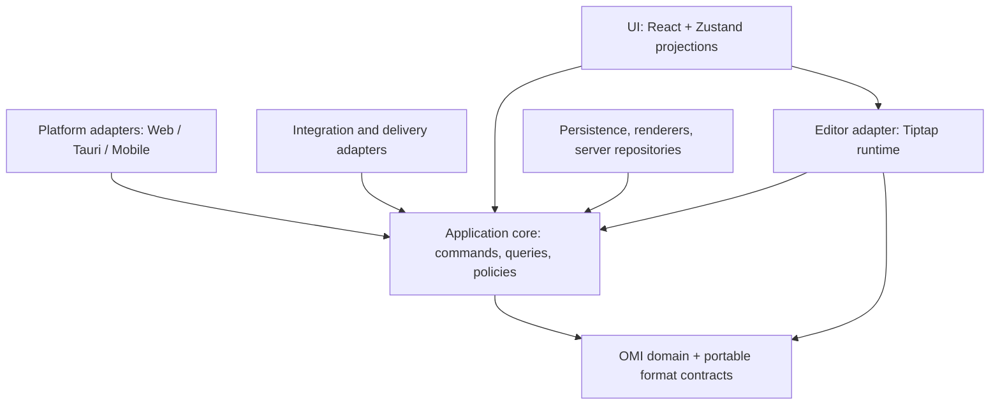
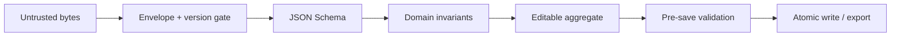
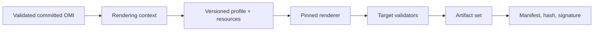
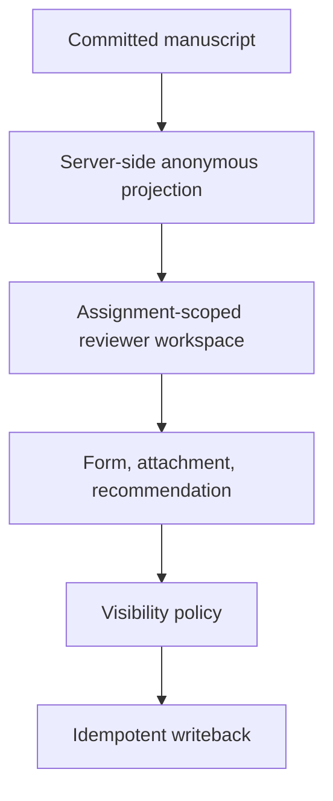
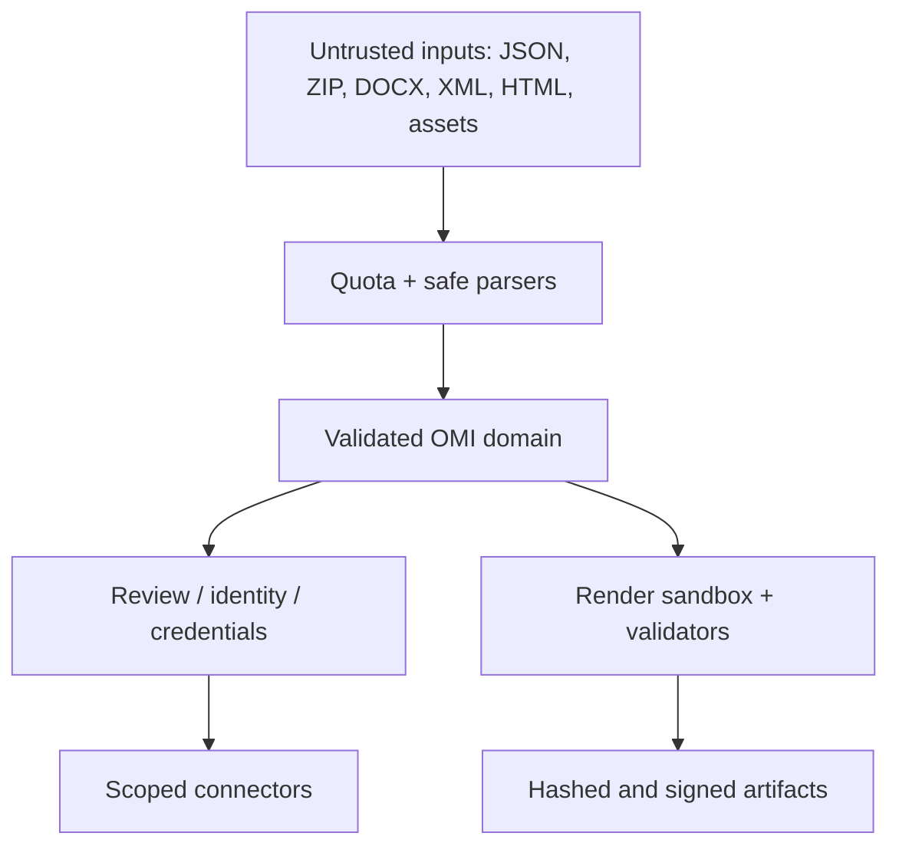

# OMI Studio 1.0 Target Architecture

**Állapot:** javasolt 1.0 célarchitektúra, döntésre előkészítve  
**Audit időpontja:** 2026-09-19  
**Elsődleges implementációs alap:** `open-manuscript-studio/main` @ `eca2cf45762116e1c00a89b3397840ed89109511`  
**Kapcsolódó források:** `omi` @ `e2f421707f1154c0ed30cb7750e0689a837e9b0a`; `omi-ojs-plugin` @ `6c0842fc1ce6c4a1ea75f7b27660af8011be303b`; `omi-omp-plugin` @ `4f7a2c0a2f29f68e3ad05ac73ca7652bc6410ac7`

## 1. Vezetői döntés

Az Open Manuscript Studio 1.0-nak nem új alkalmazásként, hanem a jelenlegi működő rendszer köré felépített, explicit contractokkal stabilizált architektúraként kell létrejönnie. A kód jelentős része használható: különösen a Tiptap-alapú szerkesztő, a tanulmányonkénti progressive mounting, a versioning szemantikája, a biztonságos OMI-konténer olvasó, a publikációs build/provenance logika, a DOCX/JATS/HTML feldolgozás, a cloud-storage adapterek, a Tauri shell, valamint az OJS/OMP pluginok szerveroldali jogosultság-ellenőrzése.

A legfontosabb 1.0 előtti változtatás nem ezek újraírása, hanem öt jelenlegi határ kijavítása:

1. Az OMI-SPEC-320 szerinti formátum legyen tényleges, futásidőben validált interoperabilitási contract. A Studio jelenleg 0.1-es envelope-ot ír, miközben az OMI repository 0.2.0-s specifikációt és sémát tartalmaz; a Studio vendorizált `src/schemas/omi-manuscript-0.2.json` fájlja üres.
2. A Tiptap/ProseMirror JSON kerüljön az editor-adapter mögé. Jelenleg az `OmiBlock.content` mezőben stringgé alakítva portable domain-adatként viselkedik, és sok exporter/importer közvetlenül értelmezi.
3. A use-case-ek kerüljenek ki a React/Zustand rétegből. A jelenlegi `useStudioStore.ts` egyszerre domain aggregate, alkalmazási service, editor session és UI state.
4. Az identity, review és connector authority legyen explicit. A két Prisma adatbázis, az account–agent kapcsolat és az OJS/OMP writeback jelenleg működik, de részben duplikált és nem alkot egyetlen tranzakciós modellt.
5. Az 1.0 release gate-ek ugyanazon RC commiton, path filter nélkül fussanak; a zöld általános build jelenleg nem bizonyít OMI schema-conformance-t vagy minden platform/integráció aktuális állapotát.

## 2. Kiindulási bizonyíték és értelmezési szabály

Az elemzésben az implementáció volt az elsődleges technikai bizonyíték. A specifikáció normatív kívánt állapotként, a teszt pedig igazolt viselkedésként szerepel. Ha ezek eltérnek, az eltérést külön jelöltük; a működő kódot nem minősítettük automatikusan hibának.

Fő bizonyítékok:

- OMI envelope és domain aggregate: `src/types/omi.ts`, `src/document/createBlankManuscript.ts`, `src/services/exportOmi.ts`.
- Editor-adatfolyam: `src/components/BlockEditor.tsx`, `src/editor/continuousManuscriptDocument.ts`, `src/editor/progressiveStudyMounting.ts`, `src/editor/blockFocusRegistry.ts`.
- Állapot és use-case-ek: `src/app/useStudioStore.ts`, `src/app/*Actions.ts`, `src/app/lastSessionPersistence.ts`.
- Verziózás: `src/model/versioning.ts`, `src/model/workingState.ts`, `src/model/revisionIntegrity.ts`.
- OMI container: `src/services/omiContainer.ts`, `src/services/omiContainerImport.ts`, `src/services/simpleZip.ts`.
- Publication: `src/model/publicationBuild.ts`, `src/model/publicationRendering.ts`, `src/model/publicationProfile.ts`, `src/services/publicationBuildManifest.ts`, `src/services/publicationArtifact.ts`, a `src/services/export*.ts` modulok.
- Backend: `server/src/app.ts`, `server/src/routes/*`, `server/src/services/*`, `server/prisma/schema.prisma`, `server/prisma/identity/schema.prisma`.
- OJS/OMP: a Studio `server/src/integrations/ojs/*` és `omp/*` moduljai, valamint a két PKP plugin route/controller/service rétege.
- Normatív formátum: OMI `docs/specifications/file-format.md`, `static/schemas/omi-manuscript-0.2.schema.json`, `tests/file-format/*`.
- Release evidence: Studio `.github/workflows/*`, `tests/*`, `e2e/*`; OMI `.github/workflows/website-build.yml`.

## 3. Célarchitektúra és dependency direction



Az ábra nyilai függőségi irányt jelentenek. A core portokat definiál, az adapterek implementálják őket. A domain nem importál Reactet, Tiptapot, Zustandot, Tauri API-t, Prisma klienst, OJS/OMP DTO-t vagy hálózati klienst.

### 3.1 Javasolt modulstruktúra

Az első 1.0 refaktor alatt nem szükséges monorepo-package-ekre bontani a projektet. A következő könyvtárhatárok már ugyanabban a repositoryban enforce-olhatók ESLint/import-boundary szabályokkal:

```text
src/
  core/
    omi/
      format/          envelope, schema negotiation, extensions
      manuscript/      aggregate, structure, blocks, metadata
      identity/        agents, contributions, evidence references
      annotations/     annotations, notes, anchors, cross-references
      references/      citations, bibliography, CSL-neutral records
      assets/          asset identity and metadata, not storage
      history/         revisions, changes, checkpoints, corrections
      proofing/        tracked changes and proofing semantics
    review/            publishing-system-neutral review model
  application/
    documents/         create, open, validate, save, close, recover
    editing/           document commands and semantic change recording
    history/           checkpoint, revision, revert, projection
    import/            importer registry and orchestration
    export/            renderer/export registry and delivery
    publishing/        builds, validation, provenance, submission
    review/            assignment workspace and writeback orchestration
    references/        lookup and synchronization
    identity/          account-agent linking use cases
    ports/             persistence, clock, crypto, storage, connector ports
  editor-tiptap/
    codec/              OMI content <-> ProseMirror conversion
    runtime/            editor instances, focus, selection, undo
    extensions/         current Tiptap extensions
    mounting/           study lifecycle and progressive mounting
  adapters/
    persistence/        IndexedDB, native file, OMI container, server
    platform/           web, Tauri, Android, Apple
    renderers/          JATS, HTML, DOCX, EPUB, LaTeX, PDF, DTP
    importers/          OMI, DOCX, PDF, HTML, table, media, references
    connectors/         OJS, OMP, Zotero, Mendeley, DeepL, AI
    api/                HTTP clients and transport DTO mapping
  ui/
    state/              Zustand projections/session state
    components/         React
server/
  api/v1/               stable transport contracts and routes
  application/          server use cases
  domain/               server-side review/identity/integration policies
  adapters/             Prisma, PKP clients, render processes, crypto
```

A könyvtárak célállapotot jelentenek, nem egyetlen mechanikus move PR-t. A migráció során re-export shim tarthatja életben a jelenlegi importokat.

### 3.2 Enforce-olt szabályok

| Réteg | Importálhat | Nem importálhat |
|---|---|---|
| `core/omi` | szabványos TS utility, tiszta validation primitives | React, Tiptap, Zustand, Tauri, fetch, Prisma, OJS/OMP |
| `core/review` | az OMI core publikus típusainak minimális részhalmaza | connector DTO, UI, Prisma |
| `application` | core és saját portok | React komponens, konkrét platform/storage/provider |
| `editor-tiptap` | core + application command/query API | Zustand store belső state, persistence adapter |
| `adapters` | application portok + core wire contract | más adapter konkrét implementációja, kivéve composition root |
| `ui` | application facade, editor facade, view-model store | Prisma, file parser, exporter belső modell |
| `server/api` | server application facade + transport schema | közvetlen Prisma művelet route handlerből |

## 4. OMI Core

### 4.1 Határ és tartalom

Az OMI Core a kézirat jelentését és hordozható reprezentációját birtokolja. Ide tartozik:

- manuscript envelope és dokumentumtípus;
- volume/study/section/block struktúra, stabil azonosítók és sorrend;
- scholarly agents és contribution attribution;
- bibliográfiai és lokális metadata;
- annotation, note, citation, bibliography, anchor és cross-reference;
- asset reference, checksum, media type és szemantikai szerep;
- history/revision szemantika, checkpoint és publication correction;
- tracked change/proofing hordozható része;
- namespaced extension adatok és feature/profile deklaráció.

Nem tartozik ide:

- ProseMirror node/mark neve vagy position;
- editor instance, selection, focus, undo stack, viewport/mount state;
- lokális fájlútvonal, browser file handle, cloud object ID;
- account session, OAuth token, OJS/OMP workflow state;
- publication CSS, font telepítési útvonal, UI panel state;
- Prisma rekord vagy API transport wrapper.

### 4.2 Jelenlegi fájlok elhelyezése

| Jelenlegi terület | 1.0 hely | Megjegyzés |
|---|---|---|
| `src/types/omi.ts` | több `core/omi/*` modul | SPLIT; az aggregate, identity, references, assets és history ne egy fájlban legyen |
| `src/model/identity.ts`, `contributorName.ts` | `core/omi/identity` | A scholarly agent marad accountfüggetlen |
| `src/model/citations.ts`, `citationClusters.ts`, `cslRendering.ts` | `core/omi/references`, illetve renderer adapter | A CSL rendering nem domain-logika |
| `src/model/notes.ts`, `noteCitations.ts`, `namedAnchors.ts`, `crossReferences.ts` | `core/omi/annotations` | Stabil anchor contract szükséges |
| `src/model/assets.ts`, `src/services/assetRepository.ts` | asset domain + persistence adapter | A metadata és a byte-store szétválik |
| `src/model/versioning.ts`, `workingState.ts` | `core/omi/history` + application history | A szemantika megtartható; a tárolás port mögé kerül |
| `src/model/proofing.ts` | `core/omi/proofing` | A string-offset és teljes before/after payload átalakítandó |
| `src/model/publicationProfile.ts`, `publicationParagraphStyles.ts` | `application/publishing` vagy renderer contract | Nem OMI manuscript domain |
| üres `src/model/content.ts`, `annotations.ts`, `manuscript.ts`, `contributors.ts` | eltávolítás re-export shim után | Nem lehetnek látszólagos domain entry pointok implementáció nélkül |

### 4.3 OMI-SPEC-320 contract és verziópolitika

Az interoperabilitási szerződés három külön verzióvonalat használ:

| Verzió | Hordozó | Jelentés |
|---|---|---|
| OMI file-format version | `omi.version` | A JSON envelope és a kötelező wire-vocabulary verziója |
| Exact schema identity | top-level `schema` URI | A konkrét JSON Schema dokumentum azonosítója |
| Container version | container manifest | A ZIP csomagolás, pathok, checksumok és entry-szabályok verziója |
| Application/generator version | provenance/generator | Mely Studio/renderer készítette az adatot; nem kompatibilitási séma |
| Manuscript revision | manuscript/history `version`/revision ID | A dokumentum tartalmi állapota; nem file-format verzió |

**Döntés:** nem kell új `schemaVersion` mező. A `schema` URI és az `omi.version` együtt elegendő és szemantikailag tiszta. Egy harmadik, ugyanazt jelentő mező driftet hozna létre. Nyitáskor ellenőrizni kell, hogy a kettő konzisztens-e.

**Source of truth:** a normatív JSON Schema az `omi` repository kiadott, immutable artifactja. A Studio:

1. checksum szerint rögzíti és vendorolja a sémát;
2. ebből generálja a wire TypeScript típusokat vagy codecet;
3. külön tartja a gazdagabb domain típusokat és invariantokat;
4. CI-ben összeveti a rögzített URI-t, verziót és checksumot;
5. ugyanazokat a conformance fixture-öket futtatja, mint az OMI repository.

A JSON Schema önmagában nem elég minden szemantikai invariant kifejezésére. A validation kétlépcsős: `schema validation` + `domain invariant validation`.

### 4.4 Validációs pontok



- **Open/import előtt:** byte- és depth-limit, biztonságos JSON parsing, envelope és verzióbesorolás.
- **Editable állapot előtt:** exact schema validation, domain invariant, referential integrity, asset manifest ellenőrzés.
- **Command után:** olcsó lokális invariant; teljes validáció nem szükséges minden billentyűnél.
- **Checkpoint/save/export/submission előtt:** teljes validation és diagnosztika. Hibás state nem írható felül ugyanarra a fájlra.
- **Container restore esetén:** először container biztonság/integritás, utána a benne lévő OMI validation.
- **Server API boundaryn:** transport schema, authorization, majd domain mapping és invariant.

### 4.5 Kompatibilitási mátrix

| Bemenet | Megnyitás | Szerkesztés | Felülírás | Eljárás |
|---|---:|---:|---:|---|
| Első fagyasztott stabil generáció, támogatott verzió | igen | igen | validáció után | normál |
| Azonos major, ismert későbbi minor, explicit forward-policyvel | igen | policy szerint | csak lossless bizonyítás után | capability + unknown-preservation ellenőrzés |
| Azonos major, újabb minor policy nélkül | karantén/read-only | nem | nem | raw export vagy Save As támogatott célba, loss reporttal |
| Újabb major | karantén/read-only | nem | nem | soha nem csendes downgrade/felülírás |
| Régebbi stabil verzió, létező explicit migrationnel | igen | migráció után | új célverzióként | pontos `from -> to` migráció és report |
| Pre-stable kísérleti Studio-formátum | best-effort egyszeri import vagy elutasítás | csak sikeres import után | új stabil fájlba | nincs általános migration framework |
| Ismeretlen/hibás envelope | nem | nem | nem | diagnosztika + raw recovery |

Az első stabil generációtól kezdve minden breaking változáshoz explicit, fixture-rel tesztelt `fromVersion -> toVersion` migráció kell. A migrációk nem láncolhatók implicit módon korlátlanul; az orchestrator ismert, auditált lépéssort állít össze.

### 4.6 Unknown extensions és lossless round-trip

- Az OMI saját jövőbeli mezőit és a vendor extensionöket külön kell kezelni.
- A szabványos extension point egy namespaced `extensions` map legyen, amelynek payloadját a core parse nélkül is megőrzi.
- Az ismert extension codec validálhat és értelmezhet, de a raw payload hashét meg kell őriznie; sikertelen értelmezés nem jelent automatikus adateldobást.
- Forward-minor fájl csak akkor szerkeszthető, ha a compatibility policy kimondja, hogy az ismeretlen core mezők megőrizhetők. Ellenkező esetben read-only.
- Normalizáló serializer nem rendezheti vagy írhatja át az ismeretlen payload szemantikáját. A JSON whitespace és object-key sorrend nem garantált; szemantikai losslessness igen.
- Exportkor a diagnosztika külön jelzi az `unchanged`, `normalized`, `downgraded`, `dropped` és `externalized` eredményt.

## 5. Editor Engine

### 5.1 Tiptap szerepe

Tiptap maradjon az 1.0 editor runtime. A jelenlegi kód bizonyítja, hogy a rich-text editing, semantic marks, citation/note/xref node-ok, continuous editing és study lifecycle erre stabilizálható. Tiptap azonban adapter, nem a portable manuscript wire model.

A célhatár:

```text
Portable OMI content tree
        ⇅ ContentCodec (versioned, tested, loss-reporting)
ProseMirror document / Tiptap extensions
        ⇅ EditorSession
React view + runtime-only state
```

Az első átmeneti `ContentCodec` olvashatja a jelenlegi stringgé alakított Tiptap JSON-t, hogy ne legyen flag-day rewrite. Ezután a callsite-ok átállnak a codec API-ra. Csak ezt követően változik a portable representation a SPEC-100-ban rögzített OMI content AST-re.

### 5.2 Portable és runtime-only adat

| Portable OMI | Runtime-only |
|---|---|
| stabil block/section/study/volume ID | Tiptap `Editor` instance |
| szemantikai block type és content tree | ProseMirror transaction és plugin state |
| inline emphasis, language, link, semantic marks | selection/head/anchor position |
| citation/note/xref/asset ID-k | focus registry és active toolbar state |
| list/table/equation struktúra | viewport, IntersectionObserver, mounted editor set |
| tracked change szemantika, author/evidence hivatkozás | local undo/redo stack |
| annotation anchor, ha stabil domain anchor | decoration és search highlight cache |

### 5.3 Study lifecycle és nagy dokumentumok

A `continuousManuscriptDocument.ts` tanulmányonkénti ProseMirror dokumentuma és a `progressiveStudyMounting.ts` küszöb-alapú mountolása jó 1.0 alap. Megtartandó:

- egy editor host per study;
- stabil OMI ID-k a projectionben;
- viewporthoz közeli mount és távoli unmount;
- fókusz-registry mint runtime service;
- globális szerkesztési sorrend külön domain helperként.

Harden követelmények:

- 500k szavas synthetic fixture-en bounded editor count és memóriabudget;
- selection megőrzése mount/unmount és tab restore alatt;
- cross-study paste/cut atomikus domain commandként;
- virtualizált outline/search result;
- parse/cache invalidation dokumentum-revision és codec-version alapján;
- background import/render Workerben, cancel/progress backpressure-rel.

### 5.4 Undo/redo és revision history

Az editor undo nem azonos a revision historyval:

- **Undo/redo:** session-local, nagy gyakoriságú, ProseMirror tranzakciók; nem interoperabilitási ígéret.
- **Working changes:** szemantikai application commandok, dirty-state és checkpoint előkészítés.
- **Revision:** tartós, azonosított, validált commit author/time/message/provenance adatokkal.
- **Publication correction:** kiadott artifacthoz kapcsolódó, auditálható domain esemény; nem egyszerű undo.

Undo után létrejövő új state checkpointolható, de az undo stack nem kerül az OMI fájlba. Revision revert új revisiont készít; nem törli a történelmet.

## 6. Application Core

### 6.1 Use-case katalógus

| Bounded context | Parancsok/use-case-ek |
|---|---|
| Documents | create, open, validate, save, Save As, close, recover, import study |
| Editing | add/move/delete study/volume/section/block, apply semantic change |
| History | checkpoint, commit revision, revert, integrity verify, prune/externalize cache |
| Import | probe, import, review diagnostics/loss, commit imported draft |
| Export | select renderer, build context, render, validate, deliver |
| Publishing | resolve profile, reproducible build, sign/hash, submit/transfer |
| Review | create anonymous projection, open workspace, save attachment/form, submit recommendation, write back |
| References | lookup, import interchange, synchronize Zotero/Mendeley, reconcile conflicts |
| Identity | link verified account evidence to scholarly agent; never implicit merge |
| Integration | authorize scoped execution, minimize payload, execute, audit, apply suggestion |

### 6.2 Command/query contract

Az application core nem igényel teljes CQRS infrastruktúrát. Egy vékony command/query facade elegendő:

```ts
type CommandResult<T> = {
  value?: T;
  diagnostics: Diagnostic[];
  events: DomainEvent[];
  changedRevision?: RevisionId;
};

interface DocumentApplication {
  open(source: DocumentSource, options: OpenOptions): Promise<OpenResult>;
  execute(command: ManuscriptCommand, expectedRevision: RevisionId): Promise<CommandResult<ManuscriptView>>;
  checkpoint(request: CheckpointRequest): Promise<CheckpointResult>;
  save(target: DocumentTarget, options: SaveOptions): Promise<SaveResult>;
}
```

Minden mutáció optimistic concurrency preconditiont (`expectedRevision` vagy digest) kap. A facade eseményt ad a Zustand projectionnek; a React komponens nem ír közvetlenül domain aggregate-et.

### 6.3 Miért nem elég kisebb módosítás?

A `useStudioStore.ts` több mint ezer sorban összeköti a state ownershipot és a use-case-eket, míg az `app/*Actions.ts` modulok gyakran közvetlen `set/get` callbacket és store-típust kapnak. Egy-egy action tisztítása nem oldja fel ezt a fordított függést. Ugyanakkor teljes state rewrite sem szükséges: először a facade ugyanazokat a jelenlegi pure model functionöket hívja, majd Zustand actionönként delegál az új use-case-re. A store végig működő compatibility facade marad.

## 7. State Management és ownership

| State osztály | Tulajdonos | Élettartam | Példák |
|---|---|---|---|
| Portable domain state | OMI aggregate/application document session | mentésig és revisionig | manuscript, structure, agents, notes, citations, asset refs |
| Durable history | `RevisionRepository` | dokumentum élettartama | revisions, parent, digest, change set/snapshot |
| Editor runtime | `EditorSession` | mount/session | Tiptap editor, selection, undo, focus |
| UI state | Zustand view-model | ablak/tab/session | panel, dialog, selected tree item, zoom |
| Account/session | auth session service | login/session | user projection, role claims; token nem általános store-ban |
| Persistence state | `DocumentSession` | nyitott dokumentum | opaque location, dirty, last saved digest, recovery status |
| Transient cache | cache service | eldobható | rendered citation, search index, parsed PM doc, thumbnails |

Zustand 1.0-ban UI/session projection. Domain object olvasható snapshotként jelenhet meg benne átmenetileg, de mutáció csak application commandon keresztül történik. A jelenlegi 2,5 másodperces automatikus checkpoint timer egyetlen scheduler service-be kerül; komponens/action nem indít párhuzamos timerláncot.

A `src/store/workspaceStore.ts` és `src/model/workspace.ts` alpha együttműködési/workspace modellje nem látszik az aktív UI főútvonalának. 1.0 core-ba nem olvasztandó; usage-bizonyítás után eltávolítandó vagy post-1.0 kísérletként izolálandó.

## 8. Persistence és authority

### 8.1 Adattulajdonosi mátrix

| Adat | Authoritative rendszer | Cache/projection | Megjegyzés |
|---|---|---|---|
| Portable manuscript current state | megnyitott OMI working document; mentéskor OMI file/container | IndexedDB recovery, Zustand view | A cloud provider csak byte-store |
| Revision history | dokumentumhoz kötött `RevisionRepository` | in-memory index; opcionális container entries | Nem az editor undo stack |
| Native working file location | platform `DocumentLocation` | session metadata | Nem portable és nem modulglobális path |
| OMI container manifest/assets | container artifact | local extraction cache | Manifest checksumok authoritative-ok az artifactban |
| Server manuscript snapshot | adott server workflow explicit snapshotja | kliens session | Nem írja felül automatikusan a lokális dokumentumot |
| Account/auth | identity database | main DB `StudioPrincipal` projection, client session | Jelszó/provider/session csak identity DB |
| Scholarly agent/contribution | manuscript OMI | account-agent link evidence | Account és agent nem azonos automatikusan |
| Institution/membership/admin | identity database | authorization claim cache | Expiry/revocation ellenőrzéssel |
| Integration credentials | encrypted credential repository | rövid életű access token cache | Nem manuscript és nem localStorage |
| Review assignment/workflow | Studio review DB vagy külső PKP, a forrás szerint | assignment-scoped workspace snapshot | OJS/OMP workflow mindig PKP authoritative |
| Publication system state | OJS/OMP | connector receipt/status | Studio csak idempotens writebackot kér |
| Publication profile | versioned profile repository/document build input | UI draft | Nem implicit manuscript domain extension |

### 8.2 Portok

```ts
interface ManuscriptRepository {
  load(location: DocumentLocation): Promise<LoadedDocument>;
  saveAtomic(location: DocumentLocation, bytes: AsyncIterable<Uint8Array>, precondition: SavePrecondition): Promise<SaveReceipt>;
}

interface RevisionRepository {
  getHead(documentId: DocumentId): Promise<RevisionRecord | null>;
  commit(commit: RevisionCommit): Promise<RevisionRecord>;
  materialize(revisionId: RevisionId): Promise<OmiManuscript>;
  verify(documentId: DocumentId): Promise<IntegrityReport>;
}

interface AssetByteStore {
  put(stream: AsyncIterable<Uint8Array>, expected?: AssetDigest): Promise<AssetReceipt>;
  get(digest: AssetDigest): Promise<AsyncIterable<Uint8Array>>;
}
```

Native mentésnél temp file + flush/fsync ahol támogatott + atomic replace + előző jó példány/recovery journal kell. Browseren File System Access API vagy explicit download receipt; Android SAF/Apple security-scoped bookmark adapter ugyanazt a portot valósítja meg.

### 8.3 History tárolás

A jelenlegi immutable, lineáris revision szemantika megtartható. A teljes snapshot minden revisionnél és a teljes history egyidejű Zustand/IndexedDB/file tárolása nagy dokumentumnál O(revision × document-size) kockázat. A cél content-addressed snapshot + opcionális delta/checkpoint kombináció, de ezt csak benchmark után kell bekapcsolni. A repository contract lehetővé teszi, hogy az első implementáció továbbra is teljes snapshot legyen.

## 9. Egységes import/export architektúra

### 9.1 Közös import contract

```ts
interface Importer {
  readonly descriptor: ImporterDescriptor;
  probe(source: ImportSource, signal: AbortSignal): Promise<ProbeResult>;
  import(source: ImportSource, context: ImportContext): Promise<ImportResult>;
}

type ImportResult = {
  draft?: OmiManuscriptDraft;
  assets: ImportedAsset[];
  diagnostics: Diagnostic[];
  fidelity: FidelityReport;
  provenance: ImportProvenance;
};
```

`ImporterDescriptor` deklarálja a MIME/ext/signature támogatást, random-access igényt, streaming képességet, max feature szintet, platform követelményt és kimeneti OMI profile-t. A `probe` nem módosít state-et. Az import draft csak explicit review/commit után kerül a dokumentumba.

### 9.2 Közös renderer/exporter contract

```ts
interface Renderer {
  readonly descriptor: RendererDescriptor;
  render(request: RenderRequest, context: RenderExecutionContext): Promise<RenderResult>;
}

type RenderResult = {
  artifacts: PublicationArtifact[];
  diagnostics: Diagnostic[];
  fidelity: FidelityReport;
  validation: ValidationReport[];
  provenance: RenderProvenance;
};

interface ArtifactDeliveryPort {
  deliver(artifacts: PublicationArtifact[], target: DeliveryTarget): Promise<DeliveryReceipt>;
}
```

A renderer byte artifactot gyárt; nem nyit file pickert és nem hív `saveAs`. A delivery adapter kezeli a browser downloadot, native Save Ast, Android SAF-et, Apple Filest, cloud object store-t vagy connector transfert.

### 9.3 Egységes diagnosztika és loss report

`Diagnostic` kötelező mezői: stabil code, severity (`info|warning|error|fatal`), phase, source location/object ID, recoverable flag, human message key, strukturált details. Kéziratszöveg és lokális path alapértelmezésben nem logolható.

`FidelityItem`: semantic path/feature, source representation, target capability, outcome (`preserved|normalized|approximated|externalized|dropped|blocked`), severity, workaround. A UI ezt jeleníti meg, de a report az application contract része.

### 9.4 Formátumok 1.0-beli besorolása

| Formátum | 1.0 architekturális státusz | Megjegyzés |
|---|---|---|
| OMI JSON/container | stabil contract | schema/container freeze és conformance után |
| DOCX import/export | stabilizálható | erős implementáció és fixture-bázis; fidelity contract kell |
| PDF import | best-effort import | explicit loss report; nem garantált szemantikai round-trip |
| HTML import/clipboard | stabilizálható subset | sanitization és remote-resource tiltás |
| spreadsheet/table, image | stabilizálható importer | asset externalization és limit |
| MusicXML | preview→stable evidence szerint | semantic fixture-ek |
| MIDI | jelenleg hibás route | a parser létezik, de `.mid/.midi` nem jut el hozzá az outer extension check miatt |
| RIS/BibTeX/CSL-JSON | stabilizálható | reference normalization és provenance |
| JATS, HTML export | legjobb stabil jelöltek | erős tesztek; exact schema/profile gate |
| print PDF | stabil jelölt | pinned Vivliostyle/font környezet és vizuális regression kell |
| interactive PDF | külön capability/profile | ne legyen implicit print PDF ígéret |
| EPUB/LaTeX | preview, amíg fidelity corpus nem teljes | contract már wrapperrel stabilizálható |
| IDML/XPress/MIF/Scribus | 1.0 preview vagy defer stable guarantee | a kód megtartandó; smoke/shape teszt nem elég kompatibilitási garanciához |

### 9.5 Streaming és nagy fájl

Az interface `Blob`, `ReadableStream`, `AsyncIterable<Uint8Array>` és szükség esetén temp/spool handle forrást fogad. A ZIP/DOCX jelenlegi bufferelése kezdetben adapteren belül maradhat, de deklarálnia kell `requiresRandomAccess` és méretlimit képességét. Minden hosszú művelet kap abort signal, progress event, memory/disk budget és deterministic cleanup viselkedést.

## 10. Publication architecture

### 10.1 Végleges pipeline



A javasolt pipeline megfelelő 1.0 alap, két pontosítással:

1. A bemenet csak validált, committed revision lehet; working state publikációja tiltott vagy egyértelműen draft artifact.
2. Validáció kell a rendering előtt és után. A renderer nem validátorhelyettesítő.

### 10.2 Contractok

- `RenderingContext`: immutable manuscript projection, resolved locale, cross-reference map, bibliography view, asset resolver, font/resource manifest, current revision digest. Nem tartalmaz raw Tiptap stringet.
- `PublicationProfile`: profile ID/version, supported document kinds, paragraph/character style mapping, page geometry, author-name typography, target-specific policy és validation profile.
- `RendererDescriptor`: renderer ID/version/build digest, input OMI profile range, output MIME/profile, deterministic settings, platform dependency.
- `PublicationArtifact`: logical role, media type, bytes handle, SHA-256, size, validation receipts.
- `BuildManifest`: input revision digest, exact schema/container/profile/renderer/validator/font/resource versions, parameters, environment facts, artifact hashes.
- `SignatureEvidence`: a manifest és pontos artifact byte digest aláírása; a kulcs/evidence nem kerül ad hoc módon a manuscript rootba.

### 10.3 Publisher profile és stílus

A jelenlegi publication profile/paragraph style/publisher CSS implementáció gazdag és megtartandó, de a `src/model/publicationProfile.ts` által végzett OMI module augmentation rossz ownershipot jelez. A profile külön verziózott build input. A manuscript legfeljebb profile reference-t vagy portable intentet hordozhat; a konkrét CSS, font fallback és page rule a publishing context része.

Author-name typography szemantikai bemenete a structured contributor name; a renderer felelős a sorrendért, inicializálásért, small capsért, locale-ért és target kimenetért. A renderelt string nem írható vissza author identityként.

### 10.4 Reprodukálhatóság

- **Semantic reproducibility:** ugyanazok a fejezetek, hivatkozások, tördelési intentek és output-struktúra.
- **Byte reproducibility:** azonos byte hash. Csak pinned renderer, fontok, timezone/locale, resource és deterministic metadata esetén ígérhető.

A manifest jelzi, melyik szint teljesült. Font substitution, network resource, aktuális dátum vagy platform printer eltérés build warning vagy blocker a profile szerint.

## 11. Publishing System Connector API

### 11.1 Közös capability contract

```ts
interface PublishingSystemConnector {
  discoverCapabilities(endpoint: ConnectorEndpoint): Promise<ConnectorCapabilities>;
  redeemLaunch(assertion: SignedLaunchAssertion): Promise<ScopedConnectorSession>;
  readSubmission(ref: ExternalSubmissionRef): Promise<SubmissionSnapshot>;
  readMetadata(ref: ExternalSubmissionRef): Promise<MetadataSnapshot>;
  readContributors(ref: ExternalSubmissionRef): Promise<ContributorSnapshot>;
  listFiles(ref: ExternalSubmissionRef, scope: FileScope): Promise<ExternalFile[]>;
  readReviewAssignment(ref: ExternalAssignmentRef): Promise<ReviewAssignmentSnapshot>;
  readReviewForm(ref: ExternalAssignmentRef): Promise<ReviewFormDefinition>;
  saveReviewForm(input: ReviewFormResponse, key: IdempotencyKey): Promise<WritebackReceipt>;
  uploadRevision(input: RevisionUpload, key: IdempotencyKey): Promise<WritebackReceipt>;
  uploadReviewAttachment(input: AttachmentUpload, key: IdempotencyKey): Promise<WritebackReceipt>;
  submitRecommendation(input: RecommendationSubmission, key: IdempotencyKey): Promise<WritebackReceipt>;
  transferArtifact(input: ArtifactTransfer, key: IdempotencyKey): Promise<WritebackReceipt>;
  returnToWorkflow(session: ScopedConnectorSession): Promise<ReturnTarget>;
}
```

Minden hívás scoped grantet, külső resource referenciát, idempotency keyt és strukturált diagnosztikát használ. A capability discovery a `omi-integration/1` közös profile-ját és vendor profile extensiont ad vissza.

### 11.2 Közös és specifikus részek

| Közös | OJS-specifikus | OMP-specifikus |
|---|---|---|
| signed launch, nonce, expiry, scopes | journal/article/galley fogalmak | monograph/chapter/publication format/proof |
| submission metadata/contributors/files | OJS recommendation/version különbségek | stage file és review round association |
| review assignment/form/result | OJS workflow route mapping | chapter-szintű reviewer confinement |
| revision/attachment upload | OJS publication artifact target | OMP native reviewer/author context |
| artifact transfer és receipt | journal return URLs | press/catalog return URLs |

A Studio jelenlegi OJS/OMP clientjei adapterként maradnak. A közös DTO-k egyetlen schema package-ből generálódnak, és ugyanazokat a contract fixture-öket futtatják a két PKP plugin ellen.

### 11.3 Authority és writeback

OJS/OMP authoritative a submission, review round, reviewer assignment, recommendation, editor workflow és publication state tekintetében. A Studio assignment-scoped cache/workspace, nem workflow master.

Külső writeback nem lehet ugyanabban az ACID tranzakcióban a lokális DB-vel. A cél durable outbox/idempotent saga:

1. lokális review/submission állapot tranzakcióban rögzül;
2. outbox esemény ugyanabban a tranzakcióban létrejön;
3. worker idempotens connector hívást végez;
4. receipt és external version mentődik;
5. retry/pending/failed állapot látható; a scholarly submissiont nem „rollbackeljük” memóriában.

## 12. Peer-review architecture



### 12.1 Domain objektumok

- `ReviewAssignment`: subject reference, reviewer principal pseudonym, round, deadlines, permissions, authority source.
- `ReviewRound`: immutable round identity és status transition policy.
- `AnonymousManuscriptProjection`: source revision digest, projection policy version, removed/transformed field report.
- `ReviewerWorkspace`: assignment-scoped notes, draft form, attachments, saved revision.
- `ReviewFormDefinition/Response`: kérdés, típus, visibility és required policy.
- `Recommendation`: controlled vocabulary + external mapping.
- `VisibilityPolicy`: reviewer/editor/author visibility; field-szintű és transition-függő.
- `WritebackReceipt`: external IDs, version, digest, accepted time, idempotency key.

### 12.2 Double-blind security boundary

A jelenlegi `reviewManuscriptService.ts` szerveroldali, allowlistes article projectionje jó alap. 1.0-ban a projection csak validált committed snapshotból készül, és kötelezően eltávolítja/transzformálja:

- agent/contribution/contact/provider identifier adatokat;
- acknowledgements/funding/conflict mezőket profile policy szerint;
- provenance/generator history azon részeit, amelyek identitást árulnak el;
- asset filename, EXIF/XMP és embedded author metadata;
- külső URL-ek tracking/query adatait;
- document properties és attachment metadata;
- cross-reference vagy bibliography mezőket, ha az anonymity policy szerint önazonosítóak.

Az assetek új assignment-scoped azonosítót kapnak. SVG csak sanitization/rasterization után jelenhet meg. A projection store, cache és endpoint `no-store`/szigorú authorization policyt használ. A kliens nem kérheti „author data nélkül” flaggel ugyanazt a teljes payloadot: a szerver választ projectiont a grantből.

## 13. Identity architecture

Hat külön fogalom:

| Fogalom | Példa | Authority |
|---|---|---|
| Account identity | Studio user UUID, recovery status | identity DB |
| Authentication-provider identity | local credential, ORCID OIDC, Google, Microsoft, institutional OIDC subject | identity DB |
| Scholarly agent identity | OMI agent, ORCID/ROR evidence | manuscript/agent registry |
| Institutional membership | institution, role, validity | identity DB/institution authority |
| Contributor attribution | agent–work role/order/contribution | manuscript OMI |
| Publication identity evidence | verified signature/attestation/key | evidence store + artifact manifest |

Authorization külön policy, amely account principal + memberships + assignment/connector grants alapján dönt. Egy account nem válik automatikusan azonos scholarly agentté azonos email vagy beírt ORCID alapján. A link explicit, bizonyítékkal és visszavonási állapottal készül; a manuscript attribution ettől függetlenül portable marad.

A jelenlegi identity Prisma schema legyen account/auth/institution authority. A main schema duplikált `User`, `UserIdentity`, `UserSession` modelljeit nem kell egyszerre törölni: először a `studioPrincipalBridge.ts` által létrehozott rekordot nevezzük és használjuk explicit `StudioPrincipal` projectionként; az új write-ok az identity DB-be mennek, az olvasás fokozatosan áll át. Kereszt-adatbázis művelethez idempotens ensure + reconciliation/outbox kell, nem látszólagos cross-DB tranzakció.

Browser auth maradhat HttpOnly/SameSite cookie. Native bearer token nem maradhat `localStorage`-ban; platform `SecureStorage` adapteren keresztül Keychain/Keystore/credential vault tárolás kell.

## 14. Integration és plugin architecture

### 14.1 Fogalmak

- `Connector`: provider-specifikus protokoll adapter.
- `Credential`: titkos, rotálható, provider/account/installáció scope-ú adat.
- `Capability`: deklarált művelet, például `reference.read`, `translation.execute`, `review.write`.
- `ExecutionGrant`: actor + connector + document/revision + purpose + data scope + capability + confidentiality + expiry + single-use/idempotency.
- `Execution`: izolált kérés minimális payload-dal, limit/timeout/cancel mellett.
- `AuditEvent`: ki, mikor, mely providert, milyen scope-pal, milyen input/output digesttel hívott.

### 14.2 Permission policy

Default deny. Egy integration nem kap automatikusan teljes manuscript-hozzáférést. A scope lehet selection, block set, metadata subset, bibliography, public manuscript projection vagy review-confidential projection. Review-confidential adat csak szerver által megállapított assignment/grant alapján mehet ki; kliensoldali boolean nem authority.

AI/DeepL output alapértelmezésben suggestion, amelyet a user application commanddal fogad el. Közvetlen domain mutation külön capability és policy, de 1.0-ban nem szükséges engedélyezni. Zotero/Mendeley read/sync reference scope-ot kap; ORCID identity evidence scope-ot; storage provider kizárólag encrypted byte object scope-ot.

A jelenlegi extension registry csak manifest/endpoint regiszter. Általános harmadik fél kód runtime/sandbox nincs. Az 1.0 ne állítsa, hogy tetszőleges executable plugin támogatott; built-in, review-olt connector adapterek legyenek stable, általános plugin runtime post-1.0.

## 15. Storage és cross-platform adapterek

### 15.1 Egységes storage modell

`DocumentLocation` opaque, platform-specifikus handle; nem string path a domainben. Adapterek:

- `BrowserFileAdapter`: File System Access API vagy download/upload fallback;
- `NativeFileAdapter`: Windows/Linux/macOS filesystem és atomic replace;
- `AndroidSafAdapter`: content URI + persistable permission;
- `AppleFilesAdapter`: security-scoped URL/bookmark;
- `SyncFolderAdapter`: a platform által szinkronizált lokális mappa, normál file semantics;
- `RemoteObjectStoreAdapter`: WebDAV/Nextcloud, Dropbox, OneDrive/SharePoint, Google Drive;
- `ContainerRepositoryAdapter`: OMI container byte stream és manifest.

A cloud provider nem értelmezi vagy módosítja a manuscriptot. Upload/download után a Studio ugyanazon schema/container validatoron halad át. Conflict handling ETag/version precondition, nem last-write-wins.

### 15.2 Platform portok

| Port | Web | Desktop/Tauri | Android | iOS/iPadOS |
|---|---|---|---|---|
| File picker/open/save | browser APIs | Tauri dialog/fs | SAF | UIDocumentPicker/Files |
| Secure storage | HttpOnly server session; WebCrypto csak megfelelő threat modellel | OS credential/key store | Android Keystore | Keychain |
| Auth handoff | redirect/cookie | deep link/native handoff | app link/custom tab | universal link/ASWebAuthenticationSession |
| Updater/installer | deployment | signed Tauri updater | signed APK/store route | App Store/TestFlight policy |
| System fonts | CSS/font availability query | native font enumeration | platform fonts | CoreText fonts |
| Share/open-with | Web Share where present | OS shell | Android intents | share sheet/document types |
| Notifications | Web Notification opt-in | native notification | notification channel | UNUserNotificationCenter |

A jelenlegi Tauri allowlist, desktop updater, Android installer és export delivery jó adapter-mag. A `nativeManuscriptFile.ts` modulglobális current pathját session-owned `DocumentLocation` váltja fel; közvetlen Tauri importok fokozatosan composition root mögé kerülnek.

## 16. Backend/API 1.0

### 16.1 Contract stratégia

Új stabil first-party contract: `/api/v1/...`. A jelenlegi `/api/...` és `/integrations/...` route-ok nem nevezendők át egyszerre. Átállás:

1. közös Zod/OpenAPI request/response schema és standard error envelope;
2. `/api/v1` route ugyanarra az application handlerre;
3. régi route compatibility facade + deprecation header/telemetria;
4. kliensek átmigrálása;
5. régi route eltávolítása csak dokumentált 1.x/2.0 policy szerint.

Az external OJS/OMP signed protocol tarthatja a telepített pluginok route-jait, de payload profile/version mezője kötelező; új generációnál `/integrations/v1` is bevezethető adapterrel.

### 16.2 Route és service határ

```text
HTTP route
  -> transport validation
  -> authentication middleware
  -> authorization policy
  -> application use case / transaction
  -> repository + connector ports
  -> response mapper + audit event
```

Route handlerből nincs közvetlen Prisma business mutation. A transaction boundary egy use-case lokális DB-módosításait fedi. Külső hívás outbox után történik. Minden create/submit/upload kap idempotency keyt; update optimistic versiont. Standard hibák: validation, unauthenticated, forbidden, conflict, rate-limited, external-unavailable, integrity-failed.

### 16.3 Secrets és audit

- Credential envelope encryption verziózott key ID-val; kulcs nem DB-ben és nem logban.
- OAuth refresh token rotation/revocation; per-provider scope inventory.
- Audit event append-only: actor, authority, action, target, scope, outcome, request/response digest, correlation ID; manuscript content nélkül.
- Identity/admin/review/integration audit retention külön policy.
- `server.ts` shutdown mindkét Prisma klienst és workert zárja.

## 17. Security trust-boundary térkép



| Boundary | Jelenlegi kódhely és bizonyíték | 1.0 kontroll |
|---|---|---|
| OMI JSON | `nativeManuscriptFile.ts` jelenleg `JSON.parse` + cast | byte/depth/duplicate-key védelem, version gate, schema+invariant, quarantine |
| OMI ZIP/container | `omiContainerImport.ts` már méret-, entry-, CRC/SHA-, traversal-, symlink-, encryption- és ambiguity-védelmet használ | KEEP; fuzz, nested/archive policy, semantic validation hozzáadása |
| DOCX/XLSX/XML/HTML | `officeImport.ts`, DOCX és PDF service-ek saját limitekkel/sanitizerrel | közös safe ZIP/XML policy, XXE/entity tiltás, no remote fetch, relationship/path quota |
| Binary assets | `assetRepository.ts`, image importer, container assets | MIME magic + decode, checksum, decompression bomb limit, SVG sanitize/rasterize, metadata strip |
| JATS/XML | Studio validator és PKP pluginok entity/DTD/LIBXML_NONET védelme | parser corpus/fuzz, exact schema/profile pinning |
| HTML artifact | HTML exporter és plugin artifact validator/CSP | scripts/iframe/form/event handler/remote URL tiltás, CSP integration test |
| OAuth/OIDC | auth, ORCID, federated és cloud routes | PKCE/state/nonce, exact redirect allowlist, short state TTL, token redaction/rotation |
| Connector endpoint | launch verifier, trusted URL/SSRF helpers | signed scoped grant, nonce/replay, redirect-by-redirect SSRF, idempotency, timeout |
| Review data | `reviewManuscriptService.ts`, peer review serializers | szerver projection, assignment ID-space, separate auth/cache/log policy, leak tests |
| AI/translation | `integrationExecution.ts`, AI client | server-minimized payload, purpose/retention consent, confidential grant, content-free audit |
| Extension/plugin | registry jelenleg manifest/endpoint | nincs arbitrary code stable claim; built-in allowlist/signing; future sandbox külön ADR |
| Publication artifact | build manifest, hash és signature modulok | exact byte hash, provenance, validators before transfer, key rotation evidence |
| Logs/CI | privacy release policy | csak synthetic/public fixtures; path/title/author/content redaction és log scanners |

## 18. Tesztarchitektúra

### 18.1 Piramis

| Szint | Kötelező tartalom |
|---|---|
| Domain unit | structure/identity/reference/anchor/assets/history invariants, property-based ID/reorder/revert tests |
| Schema/conformance | OMI valid/invalid fixtures, exact schema checksum, unknown extension, future-version quarantine |
| Migration | minden stabil `from -> to` golden fixture, idempotence ahol értelmes, loss report |
| Import/export fixture | synthetic/public input, deterministic normalized OMI, diagnostics/fidelity golden |
| Round-trip | OMI JSON/container lossless; OMI↔editor semantics; supported DOCX/JATS/HTML subset |
| Application integration | commands, concurrent expected revision, checkpoint/save/recovery, outbox |
| Server/API | `/api/v1` contract, DB transaction, authn/authz negative matrix, secrets/audit redaction |
| Connector contract | közös OJS/OMP fixture suite, capability mapping, idempotency/retry |
| E2E | Playwright core workflows; PKP docker OJS/OMP; real renderer/process paths |
| Platform | web + desktop build/run; Android SAF/install/update; iOS Files/auth/build |
| Security | SAST/dependency/SBOM/secret scan, fuzz/property parsers, SSRF/XXE/ZIP-bomb/upload corpus |
| Accessibility | axe, keyboard-only, focus/selection, screen-reader smoke, contrast/zoom |
| Performance | 10k/120k/500k words, memory/editor count, import/render/save budgets, bundle budget |
| Recovery | kill-during-save, corrupt current file, good backup, IndexedDB restore, outbox retry, update rollback |

### 18.2 Kötelező 1.0 release gate-ek

1. **Format gate:** frozen schema/container artifacts, checksum pin, OMI conformance suite mindkét repositoryban, future major/minor matrix és unknown round-trip.
2. **Data integrity gate:** open/save/container/asset/history round-trip; atomic save and recovery fault injection; nincs csendes overwrite.
3. **Import gate:** DOCX és minden stable importer corpus, diagnosztika/loss golden, size/abort/hostile input teszt.
4. **Publication gate:** JATS schema + kijelölt JATS4R profile; HTML security+a11y; PDF pinned renderer/font és vizuális golden; artifact manifest/hash/signature.
5. **Review gate:** role/visibility transition matrix, anonymous projection leak corpus, attachment metadata, author/reviewer negative access.
6. **Connector gate:** OJS és OMP közös contract + támogatott valós verziók E2E, launch replay, scope, retry/idempotency, writeback receipt.
7. **Identity/API gate:** `/api/v1` OpenAPI/schema compatibility, migrations, identity authority/reconciliation, authn/authz tests, native secure token storage.
8. **Platform gate:** a deklarált stable platformok install/open/edit/save/reopen/update smoke-ja. Preview platform hibája nem blokkol, kivéve privacy/data-loss/security regresszió.
9. **Security gate:** CodeQL/SAST, dependency/license/SBOM, secret scan, critical/high triage, parser/security corpus, no-private-fixture log scanner.
10. **Accessibility gate:** kijelölt kritikus user journey-k WCAG 2.2 AA automated + keyboard/screen-reader smoke.
11. **Performance gate:** elfogadott budgetek és 500k szavas synthetic dokumentum; bundle regression budget a jelenlegi kb. 3,76 MB main chunk csökkentésére/korlátozására.
12. **RC evidence gate:** minden fenti workflow ugyanazon exact RC commiton, path filter nélkül fut; az evidence manifest commitot, tool/verziót, artifact hash-t és eredményt rögzít.

## 19. Stabil 1.0 contractok és freeze definíció

### 19.1 Fagyasztandó contractok

- OMI-SPEC-100 portable content grammar szükséges része;
- OMI-SPEC-320 envelope + JSON Schema + compatibility table;
- OMI-SPEC-330 container manifest/path/checksum/security profile;
- OMI-SPEC-160 history exchange boundary, még ha a storage algoritmus belső marad is;
- OMI-SPEC-150 agent/contribution wire subset;
- importer/renderer diagnostics/fidelity/provenance contract;
- publication profile/build manifest/renderer descriptor;
- Publishing System Connector common DTO/profile;
- review projection/visibility/writeback contract;
- `/api/v1` public transport és error/idempotency policy;
- platform és persistence portok a core felé.

Nem kell 1.0-ra befagyasztani a teljes aspiratív OMI-SPEC-310 API-t, arbitrary plugin runtime-ot, CRDT/branching historyt vagy minden DTP exporter stabil fidelity ígéretét.

### 19.2 Architecture freeze akkor teljes, ha

1. az összes fenti ADR `Accepted` vagy explicit `Deferred`;
2. a normative schema/container/protocol artifactok release candidateje immutable digesttel elérhető;
3. a dependency boundary lint aktív;
4. az új use-case-ek csak a stabil portokon keresztül érnek adaptert;
5. a kompatibilitási és deprecation policy dokumentált;
6. minden stable/preview/deferred feature mátrixban szerepel;
7. nincs nyitott P0 adatvesztési, anonymity vagy credential blocker.

## 20. Dokumentáció–implementáció eltérések

| Téma | Dokumentáció/spec | Implementáció | Egységesítés |
|---|---|---|---|
| OMI formátum | SPEC-320 0.2.0 envelope/schema | Studio 0.1 URI/version; 0.2 schema fájl üres | OMI schema release pin + codec + explicit pre-stable import/reject |
| Container | governance egyes helyein „not started”; SPEC-330 részben vázlat | működő ZIP manifest/checksum/history/profile/output kód | a bevált implementációból normatív 0.1 container profile és fixture |
| Content model | specifikáció szemantikai modellt céloz | `OmiBlock.content` stringelt Tiptap JSON/legacy text | SPEC-100 grammar freeze + adapter migration |
| Identity | security dokumentáció részben future/Argon2id állapotot ír | identity DB, OIDC/ORCID/admin már létezik; local password scrypt | a működő identity architektúrát dokumentálni, hash policy/versioninget rögzíteni |
| API | SPEC-310 magas szintű | sok működő, de vegyes unversioned route | `/api/v1` additive contract; nem tömeges route rename |
| Review | status matrix elmarad a kódtól | server-side projection, visibility serializer és PKP writeback működik | kódból review contract/fixture; anonymity hardening |
| Release scope | Route A stable/preview mátrix létezik | CI workflow-k részben path-filteresek | exact-RC aggregate evidence workflow |

## 21. Ellenőrzött baseline

Az audit idején:

- Studio unit/pretest suite: **441/441 sikeres**;
- frontend lint és production build: sikeres;
- server Prisma generation, typecheck és build: sikeres;
- publication release tests: **16/16**, direct submission: **15/15**, publication artifact: **13/13**;
- local readiness: **6/6**;
- OMI file-format fixtures: **8/8**; OMI Docusaurus build: sikeres;
- a Studio exact commitján általános CI, CodeQL, desktop/Tauri, Android és promotion workflow zöld volt;
- az OJS és OMP plugin exact commitjain a plugin CI zöld volt.

Korlát: a jelen környezetben PHP/Rust platformtesztek nem futottak lokálisan; ezeknél a repository CI volt a bizonyíték. Az exact Studio commiton a path-filter miatt nem futott minden 1.0-readiness/PKP/iOS workflow. Az OMI website build script nem hívja a `test:file-format` suite-ot, tehát a zöld website CI önmagában nem schema-conformance gate.

## 22. Pinned source references

Az audit reprodukálásához a dokumentum az alábbi immutable commitokra hivatkozik:

- [Open Manuscript Studio commit `eca2cf4`](https://github.com/open-manuscript-initiative/open-manuscript-studio/commit/eca2cf45762116e1c00a89b3397840ed89109511)
- [OMI commit `e2f4217`](https://github.com/open-manuscript-initiative/omi/commit/e2f421707f1154c0ed30cb7750e0689a837e9b0a)
- [OMI OJS plugin commit `6c0842f`](https://github.com/open-manuscript-initiative/omi-ojs-plugin/commit/6c0842fc1ce6c4a1ea75f7b27660af8011be303b)
- [OMI OMP plugin commit `4f7a2c0`](https://github.com/open-manuscript-initiative/omi-omp-plugin/commit/4f7a2c0a2f29f68e3ad05ac73ca7652bc6410ac7)

Kiemelt, állításokat közvetlenül alátámasztó források:

- [OMI-SPEC-320 file-format specification](https://github.com/open-manuscript-initiative/omi/blob/e2f421707f1154c0ed30cb7750e0689a837e9b0a/docs/specifications/file-format.md)
- [OMI 0.2 JSON Schema](https://github.com/open-manuscript-initiative/omi/blob/e2f421707f1154c0ed30cb7750e0689a837e9b0a/static/schemas/omi-manuscript-0.2.schema.json)
- [Studio OMI aggregate types](https://github.com/open-manuscript-initiative/open-manuscript-studio/blob/eca2cf45762116e1c00a89b3397840ed89109511/src/types/omi.ts)
- [Studio Zustand store](https://github.com/open-manuscript-initiative/open-manuscript-studio/blob/eca2cf45762116e1c00a89b3397840ed89109511/src/app/useStudioStore.ts)
- [Studio Tiptap block editor](https://github.com/open-manuscript-initiative/open-manuscript-studio/blob/eca2cf45762116e1c00a89b3397840ed89109511/src/components/BlockEditor.tsx)
- [Continuous manuscript projection](https://github.com/open-manuscript-initiative/open-manuscript-studio/blob/eca2cf45762116e1c00a89b3397840ed89109511/src/editor/continuousManuscriptDocument.ts)
- [OMI container security parser](https://github.com/open-manuscript-initiative/open-manuscript-studio/blob/eca2cf45762116e1c00a89b3397840ed89109511/src/services/omiContainerImport.ts)
- [Revision model](https://github.com/open-manuscript-initiative/open-manuscript-studio/blob/eca2cf45762116e1c00a89b3397840ed89109511/src/model/versioning.ts)
- [Anonymous review projection service](https://github.com/open-manuscript-initiative/open-manuscript-studio/blob/eca2cf45762116e1c00a89b3397840ed89109511/server/src/services/reviewManuscriptService.ts)
- [Main Prisma schema](https://github.com/open-manuscript-initiative/open-manuscript-studio/blob/eca2cf45762116e1c00a89b3397840ed89109511/server/prisma/schema.prisma) és [identity Prisma schema](https://github.com/open-manuscript-initiative/open-manuscript-studio/blob/eca2cf45762116e1c00a89b3397840ed89109511/server/prisma/identity/schema.prisma)
- [Studio CI evidence run az auditált commiton](https://github.com/open-manuscript-initiative/open-manuscript-studio/actions/runs/35438980348)

## 23. Összegzés

A célarchitektúra a működő implementációt veszi körül stabil határokkal. Nem javasolt a Tiptap, a versioning szemantika, a ZIP biztonsági parser, a publication build, a cloud provider réteg, a Tauri shell vagy a PKP pluginok újraírása. A szükséges mélyebb refaktorok oka konkrét: a portable formátum és a Tiptap összemosása adatvesztési/kompatibilitási kockázat; a store-use-case összekapcsolás tesztelési és platformfüggési probléma; a duplikált identity authority és a kliensvezérelt confidential scope security kockázat; a teljes snapshot history pedig skálázási kockázat.

A helyes út: contractot bevezetni a régi kód elé, ugyanazt a viselkedést conformance fixture-rel lezárni, callsite-onként átállni, majd csak bizonyítottan használaton kívüli vagy hibás utat eltávolítani.